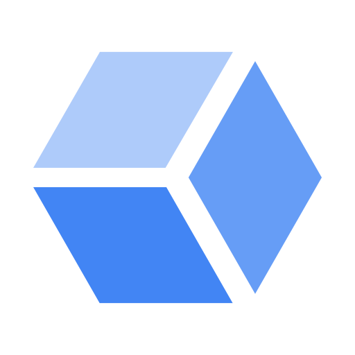

# ☁&#xfe0f; Cloud


--8<-- "includes/Cloud/Table.md"

Links TODO:

- Cloud Storage
- CloudWatch
- Azure Functions
- Glacier
- Google Cloud Storage (GCS)
- [gcloud][gcloud]
- gsutil
- Simple Notification Service

## 🛠&#xfe0f; Administration


### 💰 Cost management

Azure **quotas** apply to subscriptions and are implemented with [tags](#tags).

- **Resource quotas** trigger [alarms](#alarms) when resource creation and consumption hit a threshold. These are not to be confused with **resource limits** which can stop resources from being created, whereas quotas can not.
- **Spending quotas** trigger alarms when spending has reached a threshold.

Azure **budgets** can be viewed and administered in the **Cost Management + Billing** blade. 
Users must have at least the [**Reader**](#iam) role at the subscription scope to view, and Contributor to create and manage, budgets. 

**Resource locks :material-microsoft-azure:** are used to apply restrictions across **all users and roles** and can be applied at subscription, resource group, or resource scopes. 

- **CanNotDelete**
- **ReadOnly** effectively restricts all authorized users to the permissions granted by the [**Reader**](RBAC#roles) role
    - Storage account keys of a locked storage account cannot be listed because the list keys operation is handled through a POST request
    - Visual Studio Server Explorer will not be able to display files for a locked App Service resource, because that interaction requires write access
    - VMs in a locked resource group will not be able to be started or restarted, because those operations require a POST request

All child resources of the scope at which a lock is applied inherit the lock. A CanNotDelete lock applied to a DNS A record would also prevent the deletion of the DNS zone that the record resides in, as well as the resource group the zone resides in.

Of the [builtin roles](Azure-IAM#roles), only two have access to the `Microsoft.Authorization/*` or `Microsoft.Authorization/locks/*` actions required to create or delete locks:

- Owner
- User Access Administrator

Resource locks apply to the management plane of Azure, specifically operations sent to https://management.azure.com

Managed applications create two resource groups to implement locks:

- One resource group to contain an overview of the service, which isn't locked
- Another resource group containing the infrastructure for the service, which is locked


Sources:

- :material-file-document-multiple-outline: [Move resources to a new resource group or subscription](https://docs.microsoft.com/en-us/azure/azure-resource-manager/management/move-resource-group-and-subscription)
- Some services have limitations or requirements when moving resources between groups ([src](https://docs.microsoft.com/en-us/azure/azure-resource-manager/management/move-support-resources "Move operation support for resources"))
- Source and destination subscriptions must be within the same [AAD][Azure AD] tenant
- Destination subscription must be registered for the resource provider of the resource being moved
- Account moving the resources must have at least the following permissions:
    - Microsoft.Resources/subscriptions/resourceGroups/moveResources/action
    - Microsoft.Resources/subscriptions/resourceGroups/write


### IAM

All cloud providers offer IAM systems that are used to control access to resources, all of which establish a similar taxonomy of concepts.

The type of user that is granted access to resources is referred to variously as a **member :material-google:** or a **security principal :material-microsoft-azure:**.

Bundles of specific permissions that can be assigned to users are called **roles**.
All cloud providers offer the ability to define custom roles and come with many ready-to-use role definitions: **predefined roles :material-google:** or **built-in roles :material-microsoft-azure:**.
Roles form the basis of RBAC, which is the recommended model used by all cloud providers.

Roles are associated to users by **policies :material-google:** and **role assignments :material-microsoft-azure:**.

=== ":material-google: gcloud"

    ```sh
    gcloud projects get-iam-policy $project
    ```

The Cloud providers also still support legacy IAM systems which are deprecated.

- **Classic :material-microsoft-azure:** administrator roles included Account Administrator, Service Administrator and Co-Administrator
- **Primitive roles :material-google:** included Owner, Editor, and Viewer can still be applied to most GCP resources.


### Infrastructure

All cloud providers divide their global services into a hierarchy of geographically defined **regions**, each of which is in turn divided into **availability zones** (what AWS calls its **Global Infrastructure**).

Azure datacenters contain multiple availability zones, and every Azure region has at least **three** availability zones.

Azure services are also divided into **geographies :material-microsoft-azure:**, generally coterminous with countries.
Azure geographies are further divided into **regional pairs :material-microsoft-azure:**. Each regional pair receives rolling updates one member at a time.

Most services are regionally based, meaning the underlying hardware of that service's instance will exist in only a single Region.
Some regions, like **AWS GovCloud**, have restricted access.

Some AWS resources, however, are technically running on hardware that exists in a single Region, but presented as global. 

- [GCP regions :material-google:](https://cloud.google.com/compute/docs/regions-zones)

Resources

- [Services available on Free Tier](https://aws.amazon.com/free/?all-free-tier.sort-by=item.additionalFields.SortRank&all-free-tier.sort-order=asc)


### 👁&#xfe0f; Monitoring

|                                                                                                                                                   :material-microsoft-azure:                                                                                                                                                    |                                                            :fontawesome-brands-aws:                                                             |                                                                                                                                      :fontawesome-brands-google:                                                                                                                                       |
| :-----------------------------------------------------------------------------------------------------------------------------------------------------------------------------------------------------------------------------------------------------------------------------------------------------------------------------: | :---------------------------------------------------------------------------------------------------------------------------------------------: | :----------------------------------------------------------------------------------------------------------------------------------------------------------------------------------------------------------------------------------------------------------------------------------------------------: |
| <figure><figcaption>Azure Monitor :material-file-document-edit-outline:</figcaption></figure><figure><figcaption>Network Watcher :material-file-document-edit-outline:</figcaption></figure> | <figure><figcaption>[CloudWatch :material-file-document-edit-outline:][CloudWatch] | <figure><figcaption>[Stackdriver :material-file-document-edit-outline:][Stackdriver] :fontawesome-brands-google:</figcaption></figure>{: width='120px' }<figcaption>[Trace][Trace]</figcaption><figure></figure> |


### Resources

Cloud providers exhibit some variety in how resources can be organized.

All cloud providers support key-value **tags**, many of which can be applied to the same resource.

Any Azure resource can only exist in a single **resource group**, which can contain resources from any region or subscription.
However, resource groups may not contain other resource groups.

GCP **projects** are equivalent to Azure resource groups, in that they are containers for and direct parents to resources.
However, projects can be placed within **folders**, which do support nested hierarchies.

AWS does not have an equivalent method of organizing resources.

Azure **subscriptions** can be organized into **Management Groups**, and they **can** be nested in a hierarchy of management groups up to a maximum depth of six levels.
In AWS the **Organizational Unit (OU)**, which can organize **user accounts** (subscriptions) and the resources they contain in a nested hierarchy, appears to be equivalent.

A pattern common to Azure is that of a service being implemented in two resource types, one of which determines important configuration settings shared by all instances of the service which are contained within it.
This is the case for [storage accounts](#storage-accounts), [App Service][App Service], Azure Data Explorer clusters, etc.


| [:material-microsoft-azure:](https://docs.microsoft.com/en-us/azure/cloud-adoption-framework/ready/azure-setup-guide/organize-resources?tabs=AzureManagementGroupsAndHierarchy) | [:fontawesome-brands-aws:](https://docs.aws.amazon.com/organizations/latest/userguide/orgs_getting-started_concepts.html) | :fontawesome-brands-google: | Description                                                                   |
| ------------------------------------------------------------------------------------------------------------------------------------------------------------------------------- | ------------------------------------------------------------------------------------------------------------------------- | --------------------------- | ----------------------------------------------------------------------------- |
| Tenant                                                                                                                                                                          | Organization                                                                                                              | Organization                | Corresponds to a company or organization                                      |
| Management group                                                                                                                                                                | Organizational Unit                                                                                                       | &nbsp;                      | Logical container for user accounts and the resources created by that user    |
| Subscription                                                                                                                                                                    | Member account                                                                                                            | ?                           | Credential associated with an individual                                      |
| &nbsp;                                                                                                                                                                          | &nbsp;                                                                                                                    | Folder                      | Organize resources and their parents in a nested hierarchy                    |
| Resource group                                                                                                                                                                  | &nbsp;                                                                                                                    | Project                     | Logical container that is the direct parent to any resource, tied to a Region |
| Tag                                                                                                                                                                             | Tag                                                                                                                       | Label                       | Key-value pairs that are used to organize resources                           |

The **resource hierarchy** organizes GCP resources in 3 levels below Domain

- **Domain**
    - **Organization** corresponds to a company or organization. A single **cloud identity** is associated with a single organization and can have **super admins**

**Billing Account** tracks charges and billing account admins can set budgets.

**Payments Profile** is a Google-level resource that is used to pay for all Google services.


### 🛠&#xfe0f; Support

AWS offers various support plan tiers that provide 24/7 email, chat, and phone access to AWS cloud support engineers.

- Basic Support Plan
- Developer Support Plan (greater of $29 or 3% of monthly account usage)
- Business Support Plan
- Enterprise Support Plan (>$15,000/mo.) offers a **Technical Account Manager (TAM)**, a dedicated guide and advocate

AWS documentation is available in several places:

- [AWS documentation](https://docs.aws.amazon.com)
- [AWS Knowledge Center](https://aws.amazon.com/premiumsupport/knowledge-center) is a sprawling FAQ
- [AWS security resources](https://aws.amazon.com/security/security-resources)
- [AWS forums](https://forums.aws.amazon.com)
- Professional Services team makes white papers and webinars publicly available

### Tags

Azure tags:

- Tag **names** have a limit of 512 characters (128 characters for storage accounts) 
- Tag **values** have a limit of 256 characters. 
- Resources and resource groups are limited to **15** tags. 
- VMs cannot exceed 2048 characters for all tag names and values combined. 

### Infrastructure as Code

All cloud providers support ways of provisioning resources declaratively. 
Azure [ARM][ARM] templates are JSON, but [Bicep][Bicep] is a domain-specific language and command-line utility that can be used to generate templates from simpler, YAML-like syntax.

## 🖥&#xfe0f; Compute

### IaaS

All cloud providers offer **Infrastructure as a Service (IaaS)**, whereby virtual machines can be provisioned with specific compute resources and base operating systems.

AWS also offers configuration management services like [OpsWorks][OpsWorks] and [Systems Manager][Systems Manager]

GCP virtual machines are referred to as **instances**, and are available in three general machine family types: general-purpose, memory-optimized, and compute-optimized.
**Machine type** describes the different packaged configurations representing allocated compute resources, or what is called a **SKU** in Azure.

### Containers

- :octicons-play-24: [Build and package container artifacts](https://www.youtube.com/watch?v=ysjCt3tNyV0 'YouTube - Getting started: Build and package container artifacts')
- :octicons-play-24: [Private container registry](https://www.youtube.com/watch?v=s46l_PmXBAQ 'YouTube - Getting started: Private container registry/storage')

### Serverless


## Storage

### Archive

### Backups

[**Azure Backup**](#azure-backup) are integrated into Portal and clickable from the VM blade. 
You have to specify a **Recovery Services vault** and a **Backup policy**. 
The policy can specify frequency of backups, and other settings. Using Backup service costs $10 per VM plus the cost of used storage.

2 methods to restore data after backing up a VM to Azure Backup:

1. Restore a recovery point as a new VM
2. Restore access to files only

### Physical media

|                                                                                                                                    :material-microsoft-azure:                                                                                                                                     |                                                  :fontawesome-brands-aws:                                                   |                                                               :fontawesome-brands-google:                                                               |
| :-----------------------------------------------------------------------------------------------------------------------------------------------------------------------------------------------------------------------------------------------------------------------------------------------: | :-------------------------------------------------------------------------------------------------------------------------: | :-----------------------------------------------------------------------------------------------------------------------------------------------------: |
| <figure><figcaption>Data Box</figcaption></figure> <figure><figcaption>Import/Export Service</figcaption></figure> | <figure><figcaption>Snowball</figcaption></figure> | <figure><figcaption>Transfer Appliance</figcaption></figure> |

    
:octicons-play-24: [Uploading files to GCS](https://youtu.be/nmZxfuFIP08 "YouTube - Uploading files to GCS (Cloud Storage Bytes)")

## 🏢 Networking

All cloud providers offer an implementation of **software-defined networking (SDN)** that allows a logically isolated network to be defined as a block of IP addresses allocated from one of the private ranges (10.0.0.0/8, 192.168.0.0/16, or 172.16.0.0/12).
In AWS and GCP, this network is referred to as a **Virtual Private Cloud (VPC)**, whereas in Azure it is called a **Virtual Network (VNet)**.
In all providers, the network is confined to a single region and must have at least one IP segment called a **subnet** defined within it which must be a subset of the range used to define the virtual network itself.

The smallest possible CIDR range for a subnet in Azure is 29, which provides 3 addresses for use (Azure reserves 5).
In AWS, the smallest possible CIDR range is 28.
In AWS, VPCs have a default range of 172.31.0.0/16 and subnets have a default subnet mask of /20.

In Azure, subnets span Availability Zones, can only be deleted if empty, and their names, which are immutable, must be unique.
In AWS, a subnet exists only within a single Availability Zone.


**VNet peering** allows VMs in two separate virtual networks to communicate directly. 
In all cloud providers, this is a one-way process which must be repeated in both directions in order to have two-way communication.

In Azure, before the introduction of peering, virtual networks were connected using S2S VPN or by connecting to the same ExpressRoute circuit.
It is not required for the peered networks to be in the same region (**Global VNet peering**), subscription, or tenant, although cross-tenant peering is not available in the Portal but must be configured from the command-line or ARM templates.
VNet peering has to be disabled before moving a VNet, and a VNet can **only** be moved within the same subscription.

- There is a maximum of 100 peering connections per VNet
- Peerings cannot be moved to another resource group or subscription, so they must be disabled before moving peered VNets.

**Service endpoints** facilitate restricting traffic from Azure services. 
**Service endpoint policies** allow restricting traffic to the granularity of individual Azure service instances.

An **internet gateway** is a VPC resource that allows EC2 instances to obtain a public IP address and access the Internet.
In order to access the Internet, instances must be in a **public subnet**, one that contains a default route to the VPC's internet gateway.

- **ExpressRoute** is the main service used to connect Azure to on-premises networks, although P2S and S2S VPNs are also options.
- **Direct Connect** provides dedicated network connectivity to an AWS VPC through links offered through [APN](#apn) partners.

In GCP, in addition to peering, a **shared VPC** can be created that is associated with multiple projects.

Resources:

- [:octicons-play-24: Migrating to GCP? First Things First: VPCs](https://www.youtube.com/watch?v=cNb7xKyya5c)

### User-defined routes

In Azure, a **virtual appliance** refers to a VM running a network application like a load-balancer, firewall, or router. 
**Service chaining** refers to the process of deploying a network virtual appliance (NVA) into a hub network to route traffic between spokes using [**user-defined routes (UDR)**](#create-user-defined-routes). 
This is a method of reducing the complexity of pairing between individual spoke networks in complex hub-and-spoke architectures. <sup>AZ-103: 309</sup>

- In such a deployment, the peerings must be set to **Allow Forwarded Traffic**.

Alternatively, two peered networks can share a single virtual network gateway, say to connect to an external network.

- The pairing connection **to** the network that contains the gateway must be set to **Use Remote Gateways**
- The pairing connection **from** the network containing the gateway must be set to **Allow Gateway Transit**


### Network security

|                                                                                :material-microsoft-azure:                                                                                 |                 :fontawesome-brands-aws:                 |                                                            :fontawesome-brands-google:                                                            |
| :---------------------------------------------------------------------------------------------------------------------------------------------------------------------------------------: | :------------------------------------------------------: | :-----------------------------------------------------------------------------------------------------------------------------------------------: |
| <figure><figcaption>Network Security Group (NSG)</figcaption></figure> | <figure><figcaption>Security Group</figcaption></figure> | <figure><figcaption>Firewall Rules</figcaption></figure> |

Azure **Network Security Groups (NSGs)** are associated with **network interfaces** and contain an arbitrary number of **security rules**.
Each rule has the following properties:

- **Name**
- **Priority**: number between 100 and 4096, lower numbers indicate a higher priority
- **Source or destination**: IP address, CIDR block, service tag, or application security group
- **Protocol**: `TCP`, `UDP`, `ICMP`, or `Any`
- **Direction**: Inbound or outbound
- **Port range**; 
- **Action**: allow or deny

**Service tags** represent a group of IP address prefixes managed by Microsoft available for use in NSG rules:

- **`VirtualNetwork`**: all CIDR ranges defined for the virtual network, all connected on-premises address spaces, peered VNets or VNets connected to a VNET gateway
- **`AzureLoadBalancer`**: Virtual IP address of the host where Azure's health probes originate
- **`Internet`**: IP address space that is outside the virtual network
- **`AzureCloud*`**: IP address space for Azure, including all datacenter public IP addresses
- **`AzureTrafficManager*`**: IP address space for the Azure Traffic Manager probe IP addresses
- **`Storage`**:

NSG **flow logging** ,which saves the 5-tuple of all packets, is available as a low-cost way to monitor traffic. Flow logs record all IP flows going in and out of an NSG and are collected per NSG rule. They are charged per GB of logs collected and include a free tier of 5 GB/month.

In AWS VPCs, **Security Groups** are similar to firewall rules that regulate inbound and outbound traffic of an instance.
Outbound traffic is unrestricted by default, and every VPC contains a default security group.

A **network access control lists (NACLs)**, also like a firewall, contains inbound and outbound rules but operates on the subnet.
By default, a NACL allows all inbound and outbound traffic.

In GCP, each VPC has a set of **firewall rules** that control traffic not only into and out of the VPC, but between instances in the same VPC.
Each rule can be tagged, and individual instances with the same tags inherit those rules.

Resources:

- [:octicons-play-24: Protect your Google Cloud Instances with Firewall Rules](https://www.youtube.com/watch?v=HTVV9YzGw5k)

### DNS

|                                                                                                                                                                      :material-microsoft-azure:                                                                                                                                                                      |                                                                                                                                                       :fontawesome-brands-aws:                                                                                                                                                       |                                                                                                           :fontawesome-brands-google:                                                                                                            |
| :------------------------------------------------------------------------------------------------------------------------------------------------------------------------------------------------------------------------------------------------------------------------------------------------------------------------------------------------------------------: | :----------------------------------------------------------------------------------------------------------------------------------------------------------------------------------------------------------------------------------------------------------------------------------------------------------------------------------: | :----------------------------------------------------------------------------------------------------------------------------------------------------------------------------------------------------------------------------------------------: |
| <figure><figcaption>[Azure DNS :material-file-document-edit-outline:](#azure-dns) [:material-information-outline:](https://azure.microsoft.com/en-us/services/dns/) [:material-file-document-multiple-outline:](https://docs.microsoft.com/en-us/azure/dns/)</figcaption></figure> | <figure><figcaption>[Route 53 :material-file-document-edit-outline:](#route-53) [:material-information-outline:](https://aws.amazon.com/route53/) [:material-file-document-multiple-outline:](https://docs.aws.amazon.com/route53/?id=docs_gateway)</figcaption></figure> | <figure><figcaption>[Cloud DNS :material-information-outline:](https://cloud.google.com/dns) [:material-file-document-multiple-outline:](https://cloud.google.com/)</figcaption></figure> |


### CDN

Users can use Azure CDN as a cache, reducing load from website. 
Content is cached by the CDN until its **time-to-live (TTL)** elapses, which can be controlled in the HTTP response from the origin server.

Permanently removing content from the CDN requires it be first removed from the origin servers, meaning if the content is in a storage account it should be set to private or deleted from the storage, or the container itself should be deleted. 
Cached copies may remain in the CDN endpoint until the TTL has expired, unless it is **purged**.

There are 4 pricing tiers available within Azure CDN:

- **Azure CDN Standard from Microsoft** does not offer **dynamic site acceleration (DSA)** (cf. Azure Front Door Service)
- **Azure CDN Standard from Akamai**
- **Azure CDN Standard from Verizon**
- **Azure CDN Premium from Verizon**, for which caching is configured using a rules engine.

- AWS
    - CloudFront
- GCP
    - CDN

### Load-balancing

- Azure
    - Load Balancer
    - Application Gateway
- AWS
    - Elastic Load Balancer
- GCP
    - Load balancing


## 👨‍💻 Development

### NoSQL

NoSQL databases differ from **relational databases** in that they do not obey the principle of data **normalization**.
That is, the same data can be stored in more than one place.

This is an advantage for databases that are optimized for reads as opposed to writes, because fewer queries are needed to retrieve information.
However, when changing information that is duplicated in several places, write operations will be more laborious and prone to error.
NoSQL databases are also **horizontally scalable** because the information can be sharded horizontally more easily than relational database, which are only **vertically scalable** (meaning scaling them requires larger and larger computers) and can only be sharded vertically. ([src](https://youtu.be/v_hR4K4auoQ?t=620 "YouTube - What is a NoSQL Database? How is Cloud Firestore structured? | Get to Know Cloud Firestore #1"))

### Big Data

## History

Beginning in 2000, Amazon began developing Merchant.com, a planned e-commerce service that was intended to be the base upon which other enterprises would develop online shopping sites.
At the time, Amazon's development environment was a jumbled mess, and in the effort to consolidate and organize the enterprise into a set of well-documented APIs.

Despite these changes, software development remained sluggish, and an investigation discovered that individual teams were procuring storage, compute, and database resources independently.
AWS originated out of the effort to consolidate these resources across the enterprise and remove this bottleneck.

Azure was announced in 2008 and publicly released in 2010 after earlier experiments in cloud computing like Whitehorse and RedDog. 
In fact, references to the "classic" model predating the Azure Resource Manager (ARM) actually refer to RedDog: the "classic" portal was also known as "RedDog Front-End".


## 📘 Glossary

--8<-- "includes/Cloud/abbrs.md"

--8<-- "includes/Cloud/links.md"

--8<-- "includes/Cloud/defs.md"

--8<-- "includes/Cloud/GCP/gcloud.md"