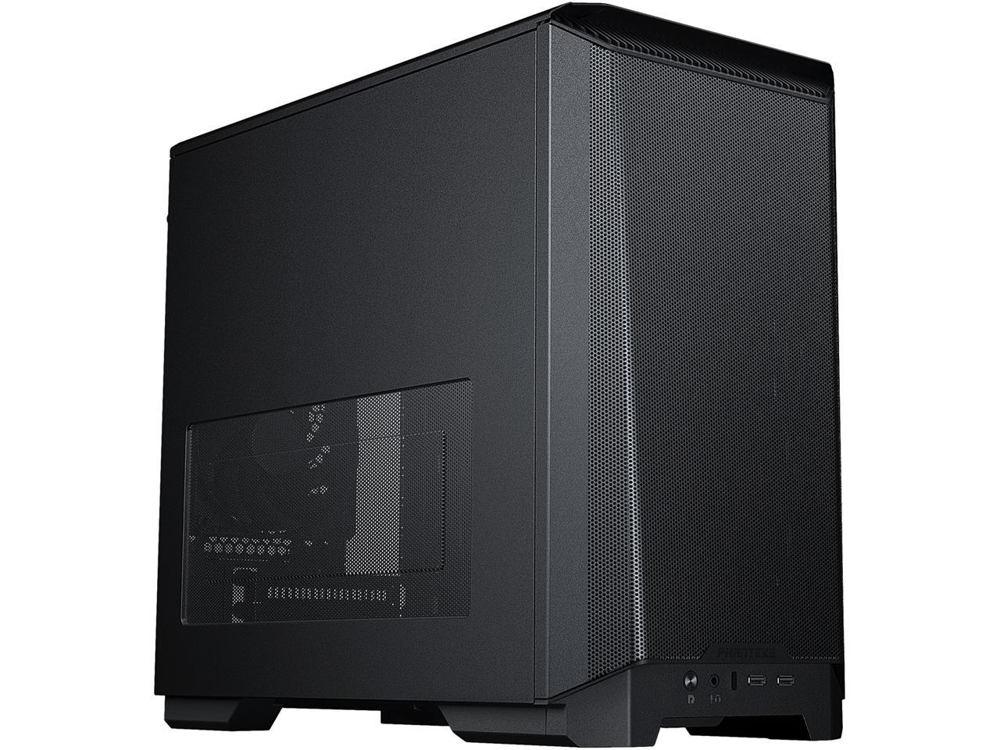
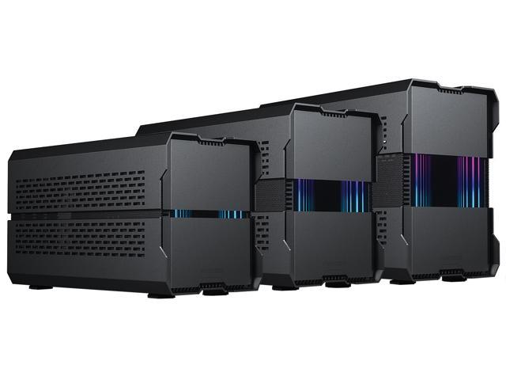
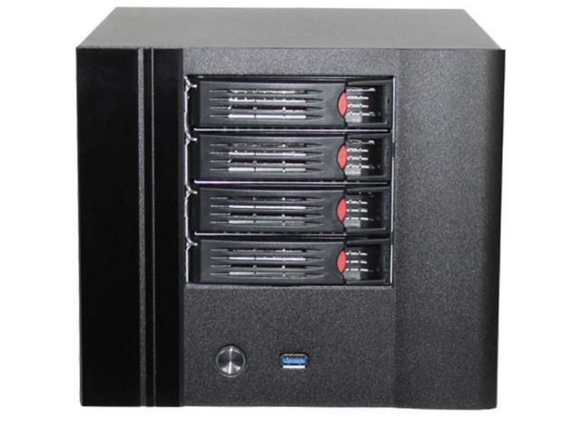
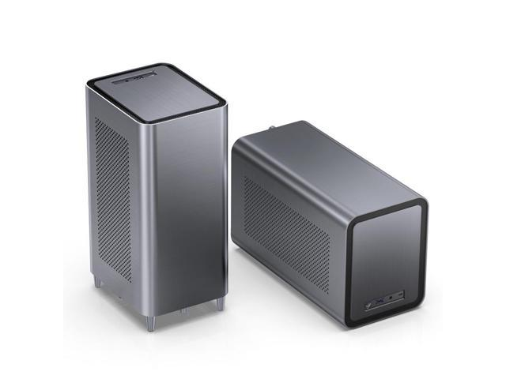

# Computers

| Item                                                                                                 |                                                                           Cost (USD) |
| ---------------------------------------------------------------------------------------------------- | -----------------------------------------------------------------------------------: |
| [Rosewill chassis (15 bays)](https://www.newegg.com/rosewill-rsv-l4000u-black/p/N82E16811147327)     |                                                                                  225 |
| [Chassis railkit](https://www.amazon.com/Rosewill-RSV-R28LX-Bearing-Sliding-Rackmount/dp/B0795Y3QM3) |                                                                                   72 |
| [Asus ROG Strix X570-F](https://www.newegg.com/asus-rog-strix-x570-f-gaming/p/N82E16813119195)       |                                                                                  200 |
| Radeon RX 6600 XT                                                                                    |                                                                                  360 |
| Ryzen 7 5700 G                                                                                       |                                                                                  300 |
| Power Supply                                                                                         |                                                                                  120 |
| 32 GB DDR4 RAM                                                                                       |                                                                                  130 |
| SATA Expansion card                                                                                  | [61](https://www.amazon.com/SupaHub-Controller-Drives-Cables-Splitter/dp/B083WF95Q1) |

| GPU                      | VRAM (GB) | PassMark                                                                          |                                                                                                                                                            Cost (USD) |
| ------------------------ | --------: | --------------------------------------------------------------------------------- | --------------------------------------------------------------------------------------------------------------------------------------------------------------------: |
| Asus Radeon RX 6600 XT   |         8 | [15862](https://www.videocardbenchmark.net/gpu.php?gpu=Radeon+RX+6600+XT&id=4444) | [480](https://www.newegg.com/asus-radeon-rx-6600-xt-rog-strix-rx6600xt-o8g-gaming/p/N82E16814126527?Description=amd%20radeon&cm_re=amd_radeon-_-14-126-527-_-Product) |
| XFX Radeon RX 6600 XT    |         8 | [15862](https://www.videocardbenchmark.net/gpu.php?gpu=Radeon+RX+6600+XT&id=4444) |    [360](https://www.newegg.com/xfx-radeon-rx-6600-xt-rx-66xt8dfdq/p/N82E16814150861?Description=amd%20radeon&cm_re=amd_radeon-_-14-150-861-_-Product&quicklink=true) |
| ASRock Radeon RX 6600 XT |         8 |                                                                                   |             [360](https://www.newegg.com/asrock-radeon-rx-6600-xt-rx6600xt-cld-8g/p/N82E16814930063?Description=amd%20radeon&cm_re=amd_radeon-_-14-930-063-_-Product) |

*[APU]: Accelerated Processing Unit: incorporating a GPU

| CPU                 | Cores (threads) |                                                                                    Cost |
| ------------------- | --------------: | --------------------------------------------------------------------------------------: |
| Ryzen 7 5700G (APU) |          8 (16) | [299](https://www.newegg.com/amd-ryzen-7-5700g-ryzen-7-5000-g-series/p/N82E16819113682) |
| Ryzen 7 5700X       |          8 (16) |   [287](https://www.newegg.com/amd-ryzen-7-5700x-ryzen-7-5000-series/p/N82E16819113735) |
| Ryzen 5 5600        |          6 (12) |    [200](https://www.newegg.com/amd-ryzen-5-5600-ryzen-5-5000-series/p/N82E16819113736) |
| Ryzen 7 5800X       |          8 (16) |                       [315](https://www.newegg.com/amd-ryzen-7-5800x/p/N82E16819113665) |
| Ryzen 7 4700G       |          8 (16) |                 [240](https://www.newegg.com/amd-ryzen-7-4700g-4000-g/p/274-000M-001P6) |

## Stan NAS

### Cases

| Picture                                                                                                                                | Form factor |                                                                                                                                                                                                                                               3.5" bays |        Cost (USD) |
| -------------------------------------------------------------------------------------------------------------------------------------- | ----------- | ------------------------------------------------------------------------------------------------------------------------------------------------------------------------------------------------------------------------------------------------------: | ----------------: |
| [{: style="width:200px;"}](https://www.newegg.com/p/N82E16811854109)                                        | Mini-ITX    | 0 [2](https://www.newegg.com/phanteks-ph-hddkt-03-stackable-3-5-hdd-bracket/p/N82E16817972005 "PH-HDDKT_03 HDD bracket") [4](https://www.newegg.com/phanteks-ph-hddkt-03-stackable-3-5-hdd-bracket/p/N82E16817972005 "PH-HDDKT_03 HDD bracket") | 70 88 106 |
| [{: style="width:200px;"}](https://www.newegg.com/black-phanteks-evolv-shift-xt-mini-itx/p/N82E16811854113) | Mini-ITX    |                                                                                                                                                                                                                                                       1 |               170 |
| [{: style="width:200px;"}](https://www.newegg.com/p/2AM-05JD-00002)                                    | Mini-ITX    |                                                                                                                                                                                                                                                       4 |                85 |
| [{: style="width:200px;"}](https://www.newegg.com/jonsbo-nas-case-mini-itx/p/2AM-006A-00074)              | Mini-ITX    |                                                                                                                                                                                                                                                       5 |               145 |

### Motherboards

| Model                                                                                             | Form Factor | SATA ports | M.2 slots | Price |
| ------------------------------------------------------------------------------------------------- | ----------- | ---------: | --------: | ----: |
| [ASRock A520M](https://www.newegg.com/p/N82E16813157962)                                          | Mini ITX    |          4 |         1 |   105 |
| [ASRock B550 Phantom](https://www.newegg.com/asrock-b550-phantom-gaming-itx-ax/p/N82E16813157949) | Mini-ITX    |          4 |         2 |   170 |
| [ASUS ROG STRIX B450-I](https://www.newegg.com/asus-rog-strix-b450-i-gaming/p/N82E16813119143)    | Mini-ITX    |          4 |         2 |   178 |
| [ASUS ROG Strix X570-I](https://www.newegg.com/asus-rog-strix-x570-i-gaming/p/N82E16813119209)    | Mini-ITX    |          4 |         2 |   265 |