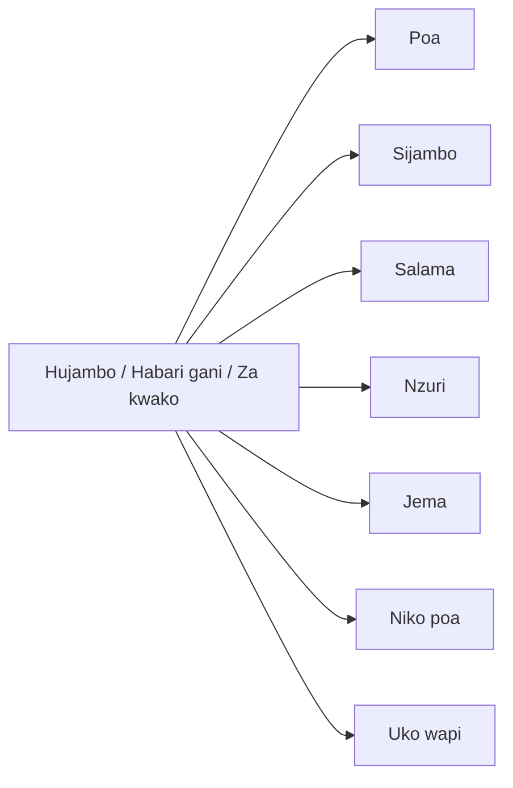

# Languages

## Spanish

#### Politeness

- Gracias por el cumplido. "Thanks for the compliment"

#### Pictures

- Puedo quedarme con algunas fotos de ti?

#### Negotiation

- Tienes una opción que tomar: ... "You have a choice to make"
- a cambio de ... "in exchange for"

#### Clarification

- 

#### Sex

- soltero "single"
- pareja "couple"

## Portuguese

#### Angolan dialect

- O português angolano soa diferente e não me acostumei.
- Estás falando por enigmas. "you're speaking in riddles"

## Swahili

#### Politeness

- Asante "Thank you"
- Karibu "You're welcome"

#### Location

- Unaishi wapi? "Where do you live?"
  - Ninaishi Marekani "I live in America"
  - Ninaishi Ukunda.
    - Ukunda wapi?
      - Ukunda karibu na Mombasa. "Ukunda is close to Mombasa"

#### Travel

- Naja Mombasa hivi karibuni "I am coming to Mombasa very soon"
  - Nipo kunondon. "I am here"

#### Sex

- Nataka kujibamba "I want to have fun"
  - Sawa jibambe "Enjoy"
  - Unataka kujibamba vipi "How do you want to have fun?"
    - Ngono "sex"
      - Hakuna ngono ya bure "There is no free sex"
- Tunaweza kulala wote? "Can we sleep together?"

Matako "butt"