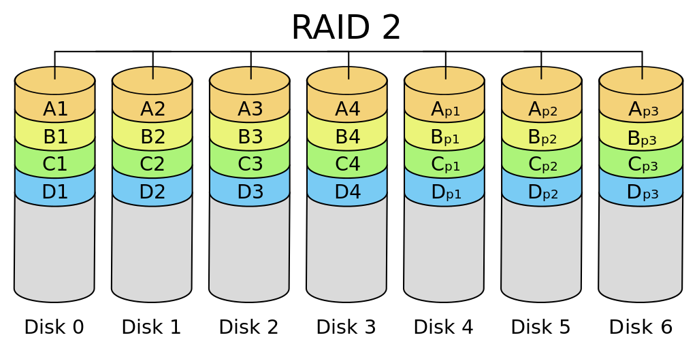
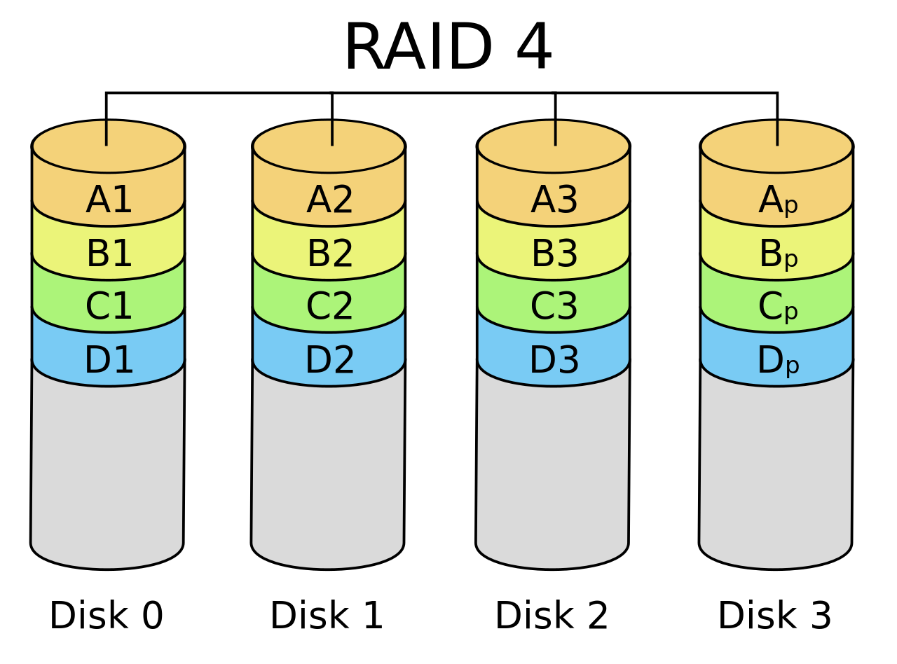
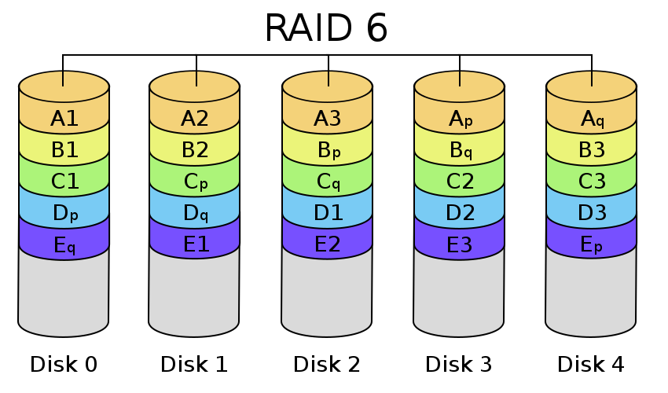

### RAID

Description | Image
---         | ---
**RAID 0** Built with no internal redundancy, each disk provides its full capacity to the array as usable storage. Although technically single disk can work, at least two disks is more typical. | 
**RAID 1** Mirrored set of drives, which have to be the same size or space will be forfeited to accomodate the smallest drive. | 
**RAID 2**  | 
**RAID 3**  | 
**RAID 4**  |  
**RAID 5** Middle ground which stripes data across multiple drives but with some redundancy, requiring at least **3** disks. An array containing *n* drives makes *n - 1* drives' worth of storage, with one drive's worth of space being used to provide redundancy. | 
**RAID 6**  | 
**RAID 10** Multiple RAID 1 arrays are treated as drives in a RAID 0, so data is striped across mirrored arrays. | 
**RAID 50** Multiple RAID 5 arrays contained in a RAID 0, and because there are at least of such arrays involved the minimum number of drives is **6**. | 