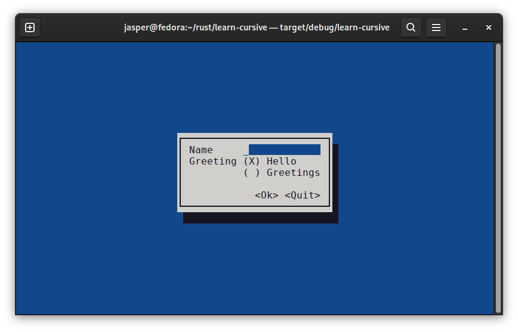
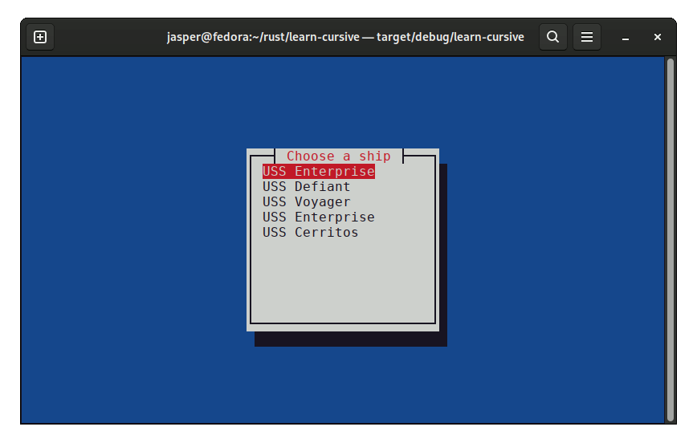

# Tasks

### Boilerplate
:   
    Cursive apps are constructed procedurally using a succession of method calls, which require the main Cursive object (conventionally named "siv" in documentation) to be mutable.

    The **default()** function which sits at the root of the cursive module streamlines some of the boilerplate involved with calling **Cursive::new()** explicitly.

    === "default()"

        ```rs hl_lines="2"
        fn main() {
            let mut siv = cursive::default();
            siv.add_global_callback('q', |s| s.quit());

            // ...

            siv.run();
        }
        ```

    === "Cursive::new()"

        ```rs hl_lines="1 4"
        use cursive::{Cursive, CursiveExt}; // (1)

        fn main() {
            let mut app = Cursive::new();
            app.add_global_callback('q', |s| s.quit());
            
            // ...

            app.run();
        }
        ```

        1. CursiveExt must be imported in order to call the **run()** method.

    Because Cursive depends on the ncurses backend, it won't work on Windows without additional modifications to Cargo.toml

    ```toml title="Cargo.toml"
    [dependencies.cursive]
    version = "0.16.3"
    default-features = false

    [features]
    default = ["pancurses-backend"]
    pancurses-backend = ["cursive/pancurses-backend"]
    ```


### Hello, World!

<figure markdown></figure>

=== "TextView"

    ```rs hl_lines="6"
    use cursive::views::TextView;

    fn main() {
        let mut siv = cursive::default();
        siv.add_layer(
            TextView::new("Hello World!")
        );
        siv.run();
    }
    ```

=== "Dialog"

    ```rs hl_lines="6"
    use cursive::views::TextView;

    fn main() {
        let mut siv = cursive::default();
        siv.add_layer(
            Dialog::around(
                TextView::new("Hello World!")
            )
        );
        siv.run();
    }
    ```

=== "EditView"

    ```rs hl_lines="28"
    use cursive::view::Nameable;
    use cursive::views::{Dialog, EditView, TextView };

    fn main() {
        let mut siv = cursive::default();
        get_name(&mut siv);
        siv.run();
    }

    fn get_name(siv: &mut cursive::Cursive) { // (1)
        siv.pop_layer();
        siv.add_layer(
            Dialog::new()
                .title("Please enter name")
                .content(EditView::new().with_name("message")) // (2)
                .button("OK", |s| {
                    greet_user(s)
                })
                .button("Quit", cursive::Cursive::quit)
        );
    }

    fn greet_user(siv: &mut cursive::Cursive) {
        let greeting = format!("Hello, {}!", 
            siv.call_on_name("message", |t: &mut EditView| t.get_content()) // (3)
                .unwrap());
        siv.pop_layer(); // (4)
        siv.add_layer(
            Dialog::around(TextView::new(greeting))
                .title("Greetings!")
                .button("OK", |s| { get_name(s) }  ), // (5)
        );
    }
    ```

    1. In order to implement multiple pages, the Cursive object must be passed as a mutable reference from function to function.
    2. **with\_name()**, only accessible after including the [**Nameable**](https://docs.rs/cursive/latest/cursive/view/trait.Nameable.html) trait, implicitly wraps the the view in a NamedView.
    3. [**call\_on\_name()**](https://docs.rs/cursive/latest/cursive/struct.Cursive.html#method.call_on_name) allows a named View to be accessed.
    4. Each function in turn runs **pop\_layer()** on the Cursive object to remove the previous View.
    5. This callback sends the user back to the first View, to repeat the process.


=== "Choice of greeting"

    ```rs
    use cursive::view::Nameable;
    use cursive::views::{Dialog, EditView, LinearLayout, ListView, RadioGroup, TextView};

    fn main() {
        let mut siv = cursive::default();
        get_name(&mut siv);
        siv.run();
    }

    fn get_name(siv: &mut cursive::Cursive) {
        siv.pop_layer();
        let mut options: RadioGroup<String> = RadioGroup::new();
        siv.add_layer(
            Dialog::around(
                ListView::new()
                    .child("Name", EditView::new().with_name("name"))
                    .child(
                        "Greeting",
                        LinearLayout::vertical()
                            .child(options.button_str("Hello"))
                            .child(options.button_str("Greetings")),
                    ),
            )
            .button("Ok", move |s| {
                let selection = &*options.selection();
                greet_user(s, selection);
            })
            .button("Quit", cursive::Cursive::quit),
        );
    }

    fn greet_user(siv: &mut cursive::Cursive, greeting: &String) {
        let name = siv
            .call_on_name("name", |t: &mut EditView| t.get_content())
            .unwrap();

        siv.pop_layer();
        siv.add_layer(
            Dialog::around(TextView::new(format!("{}, {}!", greeting, name)))
                .button("Ok", |s| get_name(s)),
        );
    }
    ```


=== "CLI integration"

    ```rs hl_lines="14-17 19-21 26"
    use cursive::view::Nameable;
    use cursive::views::{Dialog, EditView, LinearLayout, ListView, RadioGroup, TextView};

    fn main() {
        let mut siv = cursive::default();
        get_name(&mut siv);
        siv.run();
    }

    fn get_name(siv: &mut cursive::Cursive) {
        siv.pop_layer();
        let mut options: RadioGroup<String> = RadioGroup::new();

        let name = match std::env::args().nth(1) {
            Some(s) => s,
            _ => String::from("World")
        };

        let editview = EditView::new()
            .content(name)
            .with_name("name");

        siv.add_layer(
            Dialog::around(
                ListView::new()
                    .child("Name", editview)
                    .child(
                        "Greeting",
                        LinearLayout::vertical()
                            .child(options.button_str("Hello"))
                            .child(options.button_str("Greetings")),
                    ),
            )
            .button("Ok", move |s| {
                let selection = &*options.selection();
                greet_user(s, selection);
            })
            .button("Quit", cursive::Cursive::quit),
        );
    }

    fn greet_user(siv: &mut cursive::Cursive, greeting: &String) {
        let name = siv
            .call_on_name("name", |t: &mut EditView| t.get_content())
            .unwrap();

        siv.pop_layer();
        siv.add_layer(
            Dialog::around(TextView::new(format!("{}, {}!", greeting, name)))
                .button("Ok", |s| get_name(s)),
        );
    }
    ```

### Installation wizard

```rs

```

### Starships

<figure markdown>

</figure>


=== "SelectView"

    ```rs
    use cursive::traits::{Scrollable, Resizable};
    use cursive::views::{Dialog, SelectView, TextView};

    fn main() {
        let mut siv = cursive::default();
        list_ships(&mut siv);
        siv.run();
    }

    fn list_ships(siv: &mut cursive::Cursive) {
        siv.pop_layer();
        
        let mut select = SelectView::new();
        select.add_all_str(vec!["USS Enterprise", "USS Voyager", "USS Reliant"]);
        select.set_on_submit(show_ship);
        
        siv.add_layer(
            Dialog::around(
                select.scrollable()
                    .fixed_size((20, 10))
            ).title("Choose a ship"),
        );

    }

    fn show_ship(siv: &mut cursive::Cursive, starship: &str) {
        siv.pop_layer();
        let starship = String::from(starship).replace("USS ", "");
        let text = format!("The {} is a fine ship!", starship);
        siv.add_layer(
            Dialog::around(
                TextView::new(text))
                    .button("OK", |s| list_ships(s))
                    .button("Quit", cursive::Cursive::quit),
        );
    }
    ```


=== "Enums"

    ```rs hl_lines="4-5"
    use cursive::traits::{Scrollable, Resizable};
    use cursive::views::{Dialog, SelectView, TextView};

    mod models;
    use models::Starships; // (1)

    fn main() {
        let mut siv = cursive::default();
        list_ships(&mut siv);
        siv.run();
    }

    fn list_ships(siv: &mut cursive::Cursive) {
        siv.pop_layer();

        let select = SelectView::new()
            .with_all_str(vec![Starships::Enterprise, Starships::Voyager, Starships::Defiant])
            .on_submit(show_ship);

        siv.add_layer(
            Dialog::around(
                select.scrollable()
                    .fixed_size((20, 10))
            ).title("Choose a ship"),
        );
    }

    fn show_ship(siv: &mut cursive::Cursive, starship: &str) {
        siv.pop_layer();
        let starship = String::from(starship).replace("USS ", "");
        let text = format!("The {} is a fine ship!", starship);
        siv.add_layer(
            Dialog::around(
                TextView::new(text))
                    .button("OK", |s| list_ships(s))
                    .button("Quit", cursive::Cursive::quit),
        );
    }
    ```

    1. Implementing the list of starships as an enum is possible so long as the **From&lt;Starships&gt;** trait is implemented for String.
    ```rs hl_lines="3"
    enum Starships { Enterprise, Defiant, Voyager, }

    impl<'a> std::convert::From<Starships> for String {
        fn from(item: Starships) -> String {
            match item {
                Starships::Enterprise => String::from("USS Enterprise"),
                Starships::Defiant => String::from("USS Defiant"),
                Starships::Voyager => String::from("USS Voyager"),
            }
        }
    }
    ```

=== "Structs"

    ```rs hl_lines="4-5 27"
    use cursive::traits::{Scrollable, Resizable};
    use cursive::views::{Dialog, SelectView, TextView, ListView};

    mod models; // (1)
    use models::Starship;

    fn main() {
        let mut siv = cursive::default();
        list_ships(&mut siv);
        siv.run();
    }

    fn get_ships<'a>() -> Vec<Starship<'a>> {
        let output = vec![
            Starship { name: "USS Enterprise", registry: "NCC-1701", series: Series::TOS},
            Starship { name: "USS Defiant", registry: "NX-74205", series: Series::DS9 },
            Starship { name: "USS Voyager", registry: "NCC-74656", series: Series::VOY },
            ];
            output
        }
        
    fn list_ships(siv: &mut cursive::Cursive) {
        let ships = get_ships();
        siv.pop_layer();

        let select = SelectView::new()
            .with_all(ships.into_iter().map(|ship| (ship.name, ship))) // (2)
            .on_submit(show_ship); // (3)

        siv.add_layer(
            Dialog::around(
                select.scrollable()
                    .fixed_size((20, 10))
            ).title("Choose a ship"),
        );

    }

    fn show_ship(siv: &mut cursive::Cursive, starship: &Starship) {
        siv.add_layer(
            Dialog::around(
                ListView::new()
                    .child("Name:",TextView::new(starship.name))
                    .child("Registry:", TextView::new(starship.registry))
                    .child("Series:", TextView::new(starship.series))
                )
                .button("OK", list_ships)
                .button("Quit", cursive::Cursive::quit),
        );
    }
    ```

    1. The Series enum must implement the Copy trait because it may not be moved in the detailed view. This is the [simpler method](https://doc.rust-lang.org/std/marker/trait.Copy.html#how-can-i-implement-copy).
    ```rs
    #[derive(Clone, Copy)]
    enum Series { TOS,VOY, DS9 }

    impl std::convert::From<Series> for String {
        fn from(item: Series) -> String {
            String::from(match item {
                Series::TOS => "The Original Series",
                Series::VOY => "Voyager",
                Series::DS9 => "Deep Space Nine",
            })
        }
    }

    struct Starship<'a> {
        name: &'a str,
        registry: &'a str,
        series: Series
    }
    ```
    2. Using **with\_all()** or **set\_with\_all()** apparently requires a [**Map**](https://doc.rust-lang.org/stable/std/iter/struct.Map.html) struct, created by the [**map**](https://doc.rust-lang.org/stable/std/iter/trait.Iterator.html#method.map) on [**Iterator**](https://doc.rust-lang.org/stable/std/iter/trait.Iterator.html). 
    The keys of this object define the text that appears in the SelectView, and the values define the data passed to the callback specified in **on\_submit()**.
    3. Sometimes a bizarre and unhelpful compiler error will occur when this second value does not match the signature of the specified callback. 
    For example, changing **ship** to a unit type **()** will raise a compiler error:
    ```
    .on_submit(show_ship),
     --------- ^^^^^^^^^ expected signature of `for<'r, 's> fn(&'r mut Cursive, &'s ()) -> _`
     |
     required by a bound introduced by this call
    ```

=== "Vim keybindings"

    ```rs hl_lines="2 3 31-39"
    use cursive::traits::{Scrollable, Resizable};
    use cursive::views::{Dialog, SelectView, TextView, ListView, OnEventView};
    use cursive::event::EventResult;

    mod models; // (1)
    use models::Starship;

    fn main() {
        let mut siv = cursive::default();
        list_ships(&mut siv);
        siv.run();
    }

    fn get_ships<'a>() -> Vec<Starship<'a>> {
        let output = vec![
            Starship { name: "USS Enterprise", registry: "NCC-1701", series: Series::TOS},
            Starship { name: "USS Defiant", registry: "NX-74205", series: Series::DS9 },
            Starship { name: "USS Voyager", registry: "NCC-74656", series: Series::VOY },
            ];
            output
        }
        
    fn list_ships(siv: &mut cursive::Cursive) {
        let ships = get_ships();
        siv.pop_layer();

        let select = SelectView::new()
            .with_all(ships.into_iter().map(|ship| (ship.name, ship)))
            .on_submit(show_ship);

        let select = OnEventView::new(select)
            .on_event_inner('k', |s, _| {
                let cb = s.select_up(1);
                Some(EventResult::Consumed(Some(cb)))
            })
            .on_event_inner('j', |s, _| {
                let cb = s.select_down(1);
                Some(EventResult::Consumed(Some(cb)))
            });

        siv.add_layer(
            Dialog::around(
                select.scrollable()
                    .fixed_size((20, 10))
            ).title("Choose a ship"),
        );

    }

    fn show_ship(siv: &mut cursive::Cursive, starship: &Starship) {
        siv.add_layer(
            Dialog::around(
                ListView::new()
                    .child("Name:",TextView::new(starship.name))
                    .child("Registry:", TextView::new(starship.registry))
                    .child("Series:", TextView::new(starship.series)) // ...
                )
                .button("OK", list_ships)
                .button("Quit", cursive::Cursive::quit),
        );
    }
    ```

    1. 
    ```rs title="models.rs"
    #[derive(Clone, Copy)]
    enum Series { TOS, TNG, VOY, }

    impl std::convert::From<Series> for String {
        fn from(item: Series) -> String {
            String::from(match item {
                Series::TOS => "The Original Series",
                Series::TNG => "The Next Generation",
                Series::VOY => "Voyager",
            })
        }
    }

    struct Starship<'a> {
        name: &'a str,
        registry: &'a str,
        series: Series
    }
    ```

=== "JSON"

    ```rs hl_lines="5-6 25 45-46"
    use cursive::event::EventResult;
    use cursive::traits::{Resizable, Scrollable};
    use cursive::views::{Dialog, ListView, OnEventView, SelectView, TextView};

    mod models; // (1)
    use models::Starship;

    fn main() {
        let mut siv = cursive::default();
        list_ships(&mut siv);
        siv.run();
    }

    fn get_ships() -> Vec<Starship> {
        let f = std::fs::read_to_string("starships.json").unwrap();
        let output: Vec<Starship> = serde_json::from_str(&f).unwrap();
        output
    }

    fn list_ships(siv: &mut cursive::Cursive) {
        let ships: Vec<Starship> = get_ships();
        siv.pop_layer();

        let select = SelectView::new()
            .with_all(ships.into_iter().map(|ship| (ship.name.clone(), ship))) // (2)
            .on_submit(show_ship);

        let select = OnEventView::new(select)
            .on_event_inner('k', |s, _| {
                let cb = s.select_up(1);
                Some(EventResult::Consumed(Some(cb)))
            })
            .on_event_inner('j', |s, _| {
                let cb = s.select_down(1);
                Some(EventResult::Consumed(Some(cb)))
            });

        siv.add_layer(Dialog::around(select.scrollable().fixed_size((20, 10))).title("Choose a ship"));
    }

    fn show_ship(siv: &mut cursive::Cursive, starship: &Starship) {
        siv.add_layer(
            Dialog::around(
                ListView::new()
                    .child("Name:", TextView::new(&starship.name)) // (3)
                    .child("Registry:", TextView::new(&starship.registry))
                    .child("Series:", TextView::new(starship.series)), 
            )
            .button("OK", list_ships)
            .button("Quit", cursive::Cursive::quit),
        );
    }
    ```

    1. The **serde\_derive::Deserialize** derive is necessary for the mapped struct as well as the Series enum because it appears as a member of the Starship struct.
    ```rs title="models.rs" hl_lines="1 18"
    #[derive(Clone, Copy, serde_derive::Deserialize)]
    enum Series {
        TOS,
        DS9,
        VOY,
    }

    impl std::convert::From<Series> for String {
        fn from(item: Series) -> String {
            String::from(match item {
                Series::TOS => "The Original Series",
                Series::DS9 => "Deep Space Nine",
                Series::VOY => "Voyager",
            })
        }
    }

    #[derive(serde_derive::Deserialize)]
    struct Starship {
        name: String,
        registry: String,
        series: Series,
    }    
    ```
    2. A **clone()** is necessary here, although I'm not sure why. A reference is not accepted.
    3. References are accepted here, as is a clone().


=== "PostgreSQL"

    ```rs hl_lines="1-4 11-12"
    #[macro_use] extern crate diesel;
    use diesel::prelude::*;  
    use diesel::pg::PgConnection;
    use diesel::result::QueryResult;

    use cursive::view::{Nameable, Resizable};
    use cursive::views::{Dialog, EditView, ListView, SelectView, TextView};

    mod models; // (3)
    use models::Starship;
    mod schema;
    use schema::starships::dsl::*;

    fn main() {
        let mut siv = cursive::default();
        list_ships(&mut siv);
        siv.run();
    }

    fn get_ships() -> QueryResult<Vec<Starship>> {
        dotenv::dotenv().expect("Couldn't load .env file");
        let url = &std::env::var("DATABASE_URL")
            .expect("Couldn't retrieve DATABASE_URL environment variable");
        let conn = PgConnection::establish(url).unwrap();
        starships.load::<Starship>(&conn)
    }

    fn list_ships(siv: &mut cursive::Cursive) {
        let ships: Vec<Starship> = get_ships().unwrap();
        siv.pop_layer();
        siv.add_layer(
            Dialog::around(
                SelectView::new()
                    .with_all(
                        ships
                            .into_iter()
                            .map(|ship| (format!("{} ({})", ship.name, ship.registry), ship)),
                    )
                    .on_submit(show_ship)
            )
            .button("Quit", cursive::Cursive::quit)
            .button("Add", add_ship)
        );
    }

    fn show_ship(siv: &mut cursive::Cursive, ship: &Starship) {
        siv.add_layer(
            Dialog::around(
                ListView::new()
                    .child("Name:", TextView::new(&ship.name))
                    .child("Registry:", TextView::new(&ship.registry))
                    .child("Crew:", TextView::new(format!("{}", ship.crew))),
            )
            .button("OK", list_ships),
        )
    }

    fn add_ship(siv: &mut cursive::Cursive) {
        let conn = get_connection().unwrap();
        siv.add_layer(
            Dialog::around(
                ListView::new()
                    .child("Name:", EditView::new().with_name("name"))
                    .child("Registry:", EditView::new().with_name("registry"))
                    .child("Crew:", EditView::new().with_name("crew")),
            )
            .button("Ok", move |s| {
                let input_name = s
                    .call_on_name("name", |t: &mut EditView| t.get_content())
                    .unwrap();
                let input_registry = s
                    .call_on_name("registry", |t: &mut EditView| t.get_content())
                    .unwrap();
                let input_crew = s
                    .call_on_name("crew", |t: &mut EditView| t.get_content())
                    .unwrap()
                    .parse::<i32>()
                    .unwrap();
                let input: Starship = Starship {
                    name:       (*input_name).clone(), // (2)
                    registry:   (*input_registry).clone(),
                    crew:       input_crew,
                };
                input.insert_into(starships) // (4)
                    .get_result::<Starship>(&conn) // (5)
                    .unwrap();
                list_ships(s);
            }).min_width(30)
        );
    }
    ```

    1. 
    ```rs
    use crate::schema::starships;

    #[derive(Debug, Queryable, Insertable)]
    pub struct Starship {
        pub name: String,
        pub registry: String,
        pub crew: i32,
    }
    ```
    2. Struct intiializations move values, so the String must be deeply copied, here using [**String::clone**](https://doc.rust-lang.org/std/clone/trait.Clone.html#tymethod.clone)
    3. 
    ```rs
    use crate::schema::starships;

    #[derive(Debug, Queryable, Insertable)]
    pub struct Starship {
        pub name: String,
        pub registry: String,
        pub crew: i32,
    }
    ```
    4. [**insert\_into**](https://docs.rs/diesel/1.4.8/diesel/prelude/trait.Insertable.html#method.insert_into) is a method on the Insertable trait Equivalent to:
    ```rs
    diesel::insert_into(starships)
        .values(&input)
        .get_result::<Starship>(&conn)
        .unwrap();
    ```
    5. Diesel collects various methods that execute a query into the [RunQueryDsl trait](https://docs.rs/diesel/1.4.8/diesel/query_dsl/trait.RunQueryDsl.html).
    These methods include:
    
        - [**get\_result**](https://docs.rs/diesel/1.4.8/diesel/query_dsl/trait.RunQueryDsl.html#method.get_result) which returns the affected row
        - [**get\_results**](https://docs.rs/diesel/1.4.8/diesel/query_dsl/trait.RunQueryDsl.html#method.get_results) which returns a Vec of affected rows
        - [**execute**](https://docs.rs/diesel/1.4.8/diesel/query_dsl/trait.RunQueryDsl.html#method.execute) which returns a usize of affected rows.

### Raven

A multi-page wizard can be constructed with the [cursive-tabs](https://github.com/deinstapel/cursive-tabs) crate.

```rs
use cursive::views::{TextView};
use cursive::view::Nameable;
use cursive_tabs::TabPanel;

fn main() {
    let mut siv = cursive::default();
    siv.add_global_callback('q', |s| s.quit());

    let tabs = TabPanel::new()
        .with_tab(TextView::new(include_str!("assets/raven1")).with_name("1"))
        .with_tab(TextView::new(include_str!("assets/raven2")).with_name("2"))
        .with_tab(TextView::new(include_str!("assets/raven3")).with_name("3"))
        .with_tab(TextView::new(include_str!("assets/raven4")).with_name("4"))
        .with_tab(TextView::new(include_str!("assets/raven5")).with_name("5"))
    ;

    siv.add_layer(tabs);
    siv.run();
}
```

Key bindings are added as global callbacks. This functionality works because the TabPanel is nameable and can be retrieved by the callback by its name.

```rs hl_lines="18-26"
use cursive::views::{TextView};
use cursive::view::Nameable;
use cursive::event::Key;
use cursive_tabs::TabPanel;

fn main() {
    let mut siv = cursive::default();
    siv.add_global_callback('q', |s| s.quit());

    let tabs = TabPanel::new()
        .with_tab(TextView::new(include_str!("assets/raven1")).with_name("1"))
        .with_tab(TextView::new(include_str!("assets/raven2")).with_name("2"))
        .with_tab(TextView::new(include_str!("assets/raven3")).with_name("3"))
        .with_tab(TextView::new(include_str!("assets/raven4")).with_name("4"))
        .with_tab(TextView::new(include_str!("assets/raven5")).with_name("5"))
    ;

    siv.add_layer(tabs.with_name("Tabs"));
    siv.add_global_callback(Key::PageUp, |s| {
        let mut tabs: cursive::views::ViewRef<TabPanel> = s.find_name("Tabs").unwrap();
        tabs.prev();
    });
    siv.add_global_callback(Key::PageDown, |s| {
        let mut tabs: cursive::views::ViewRef<TabPanel> = s.find_name("Tabs").unwrap();
        tabs.next();
    });

    siv.run();
}
```
