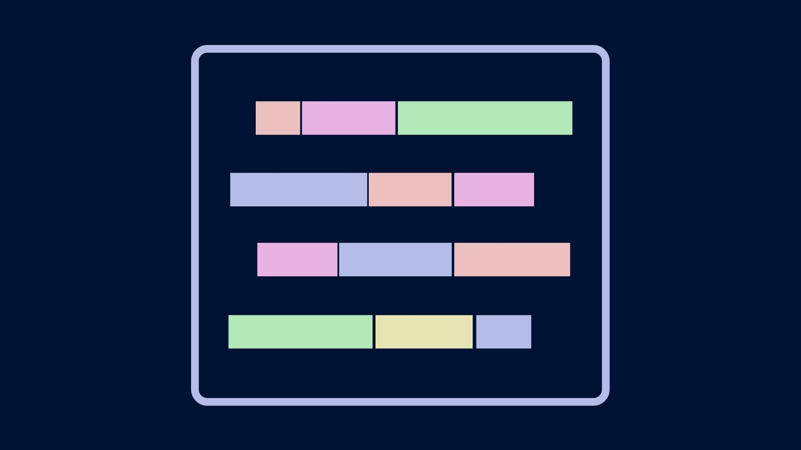
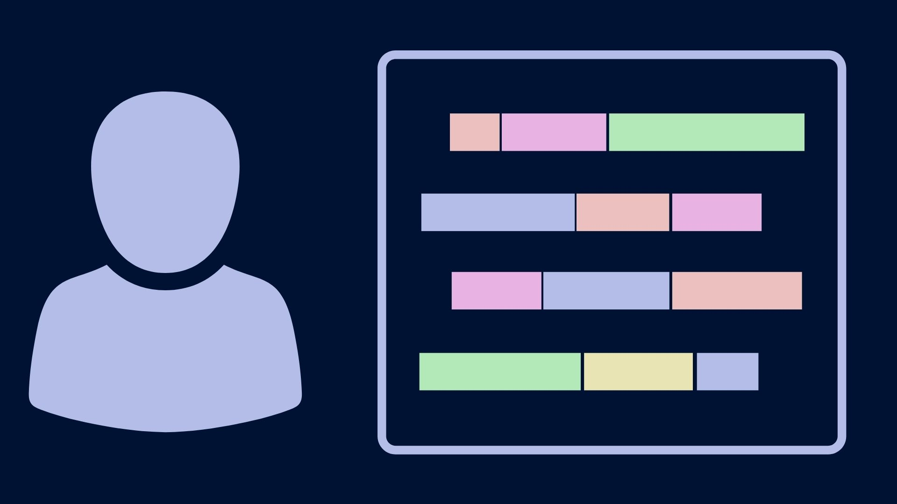

# Django
:   
    --8<-- "cues/Explain.md"

    Django is a web application framework written in Python. 
    Today I'm going to show you how to code a simple To-Do web application. 
    If you've found this video, that probably means you've already seen some of the many other popular YouTube tutorials that you how to do it. 

    What I'll show you is how to integrate it with the Bulma CSS framework!

## Todo

#### Setup
:   
    I'm going to assume you have a working installation of Python. 

    - **Windows** => Microsoft Store. 
    - If you're running Mac or Linux, you might already have a working Python installation, but if not there are many different ways of installing Python.

    Before we install Django we're going to set up a virtual environment.

#### Venv
:   
    {: align=left width=200px }

    Python only tolerates a single installed version of a package at any given point in time. This means that as you add packages to your installation, it's only a matter of time before you run into a conflict, where a package demands a  version of a dependency that conflicts with the one you have installed.

    The most common way to avoid this is by creating a virtual environment. A virtual environment is like a isolated copy of Python that is only activated when you need. Virtual environments let you install packages safely, keeping your system installation clutter-free.

    I have PowerShell open, and if you have a Windows computer you should have it too. I'm going to `cd` to the venv directory. This is the directory where I like to install all my virtual environments. But you're free to manage virtual environments however you choose. I run `ls` here and you can see I've already set up multiple virtual environments.

    Let's create a new virtual environment by running `python -m venv django`. After a few moments, the virtual environment will be created.

    Now let's run `ls` again, and we can see that **this** directory was created. Let's see what a virtual environment looks like.

    There are a few directories and a config file. If we inspect the config file `notepad pyvenv.cfg`, we see that it specifies the currently installed version of Python. It also points to the system installation of Python. If I run **`Get-Command python`** I can see that the system installation of Python points to this directory. Depending on how you installed Python, the directory that appears here may be different. And if you're watching this video in the future, your version of Python will be newer than this.

    The business end of the virtual environment is actually here, in **Scripts**. Let's navigate there and run `gci` again.

    Here we see activation scripts and some executable files. One of these is python.exe, which is the Python interpreter. We also have pip.exe.

    At the moment, this is just a directory - if we type python.exe we will be running the system installation of Python. I'll prove it.

    ```powershell
    gcm python | select source
    ```

    ```sh
    which python
    ```

    In order to tell the system we want to use the virtual environment, we're going to run this activation script, Activate.ps1.

    Now we are in the virtual environment. We can confirm this by running `gcm python.exe`, and we can see that running Python now will run the interpreter that we just installed. What happens when we want to run `pip`? We can see that pip, too, now points to the version we just installed in the virtual environment. If we install a package now, it will be installed only to the virtual environment, and not the system installation.

    Let's install Django.
    ```py
    pip install django
    ```
    In a few moments the installation will complete.

    We can confirm the installation completed by running `pip list`. Here is Django, version 3.xx. And if we run `gci` again, we can see that some new executable files have been installed to this directory.  But how can we be sure that Django wasn't installed to the system installation? We can exit the virtual environment by running `deactivate`.

    Now we have returned to the system installation of Python. We can confirm this again by running `gcm`. And now when we check the list of installed packages using `pip list`, we see that Django is not present. We successfully installed Django to the virtual environment alone, leaving our system installation untouched.

    This is the recommended way of installing Python packages.

#### Project skeleton
:   
Before we leave the virtual environment and start coding, let's take another look at the Scripts directory. One of the executables that has been installed is [`django-admin.exe`](https://docs.djangoproject.com/en/3.1/ref/django-admin/). This is Django’s command-line utility for administrative tasks. 

Other languages have similar utilities that are used to facilitate common administrative tasks, for example building out the skeleton of a new project, which you would do like this:
```sh
django-admin startproject project
```
This is all I'm going to use django-admin for in this course, but there is a lot you can do with it.

Once the project has been created, let's go into the directory and peek around.
As we can see, a Django project has a **manage.py** script and contains a nested directory with the same name as that of the project.

The **manage.py** is actually what you will use to do a lot of administration for your web application. For example, we can run `python manage.py runserver` to start the web application. If we open a web browser to the address and port used by the server, we can see Django's default landing page. Let's close the server by pressing <kbd>Ctrl</kbd><kbd>C</kbd>

Let's run another command
```sh
python manage.py startapp application
```
If we get the directory contents again, we see that, similar to the `django-admin` command we ran earlier, this command erects a directory of content. Let's take a look and see what it created.

More Python scripts.. but what are these files for? Off the bat, we notice this directory has a **urls.py**. Is this similar to the **urls.py** created in the project directory?

#### Project structure
:   
    {: align=left width=200px }

    Django web apps are structured into **projects** and **applications**. It's important to understand the distinction, because it is not immediately obvious to a novice.

    - **project** describes a Django web application

        - The project's root directory contains **manage.py**. 
        - The root directory contains a subdirectory with the same name as the root, but which contains other Python scripts, like urls.py and especially **settings.py**. 
        - This is called the **project directory**. 

    - An **application** refers to a Python package that provides some set of features. 

        - Applications are a component of projects. 
        - Application directories also contain a urls.py, but that's where the similarity ends.

    For a person who's new to Django, this means that much of the core functionality of your **project** will actually be contained in an **app**, which can feel awkward at first. But bear with it for now.

#### settings.py
:   
    {: align=left width=200px }

    Before we move any further, let's open the project folder and go to **settings.py**. 

    If we scroll down to **`INSTALLED_APPS`** we need to make sure we add the name of the application that we just created in quotes to the list. This list is what Django uses to construct its namespace. 

    Let's also take a look at this token value  (`SECRET_KEY`) that is provided in plaintext. Because I'm guessing you're just learning Django and not about to deploy your web application to production, doing this is okay. But for production systems, this is a no-no. I'm going to show you an easy and simple it is to protect your secrest. But if you don't want to spend time on this section, feel free to use the time-codes to skip ahead.

#### Model

In order to determine the shape of a web app's data, Django uses what is called a **Model**. If you're familiar with object-oriented programming, this will be the easiest part.

Let's go into the application's **models.py** and create a Model. Models form the basis of how Django organizes data. 

```py title="models.py"
from django.db import models

class Task(models.Model):
  title = models.CharField(max_length=50)
  # done = models.BooleanField()
  # created = models.DateTimeField(auto_now_add=True)
```
We're subclassing `models.Model`, and the model defines a series of named **fields** which are instances of each of these classes. Some of these fields require specific attributes to be defined. For example, **`CharField`** requires a **`max_length`** attribute to be defined. 

Defining a model is not permanent, so let's stick with just the one title field. We'll add to it in a moment. Let's move on to the topic of migrations.

When you make even the slightest to the models used in your web application's, Django requires you to perform what's called a **migration**. A migration keeps the web application's database consistent with the model. This is a two-step process from the command-line.
```sh
python manage.py makemigrations
```
This command analyzes the Model classes you've defined for the web application, and then it actually codes Python scripts for you to change the database accordingly. You'll find them in the migrations directory, see? 

To run these scripts, run
```sh
python manage.py migrate
```
Because this is the first time I ran a migration, it created a database for me from scratch, here. We can see that it's a **SQLite** database, a lightweight option that is used a lot in Python development. In fact, the Python Standard Library includes a SQLite module, so every Python installation is able to create and manipulate SQLite databases.

How did Django know to produce an SQLite database, and not another? Let me show you.

In the **settings.py** there is a dictionary named **DATABASES**

```py
DATABASES = {
  'default': {
    'ENGINE': 'django.db.backends.sqlite3',
    'NAME': BASE_DIR / 'db.sqlite3',
  }
}
```
"ENGINE" specifies the driver to use with the database. Django supports four databases out of the box: PostgreSQL, MySQL, Oracle, and SQLite. The other 3 options are more involved and require a server to be set up, so if you ever want to use them, you'll have to define values for `HOST`, `PORT`, `USER`, and `PASSWORD` in this dictionary. But SQLite keeps the database in a local file - no need to mess with any of that. We don't have time for an in-depth discussion of SQLite, but what I will do is show you how we can quickly take a look at this database within VS Code.

Open the Extensions Marketplace and search for sqlite. The top app, SQLite Explorer by "alex", is what we're looking for. Click the green install button. 

I already have this extension installed, so I'm going to return to the File Explorer. Now I right click on **db.sqlite3** and select open database. Another section named SQlite explorer should open in the file explorer. If you installed SQLite Explorer but don't see this section, check the hamburger menu in the top right and make sure it's enabled.

SQLite Explorer allows you to view the schema and content of SQLite tables. Let's expand it. Each of these is a **table** -- the file is the database. All of these tables comes from an application in our Django project, and all but one of them were automatically implemented. The one we created is here, at the top - **application_task**.

When we expand the table, we see Django added an integer id field, as well as the field we defined. "`varchar`" is SQL's equivalent of a string, more or less. 

Let's go back to the code and make another change to the Model. We're going to add a value so we can mark completed tasks off our to-do list.
```py
# models.py
from django.db import models

class Task(models.Model):
  title = models.CharField(max_length=50)
  done = models.BooleanField(default=False)
  # created = models.DateTimeField(auto_now_add=True)
```
`BooleanField` doesn't require a `max_length`, but it does require a default value.

We changed the model, so the database will have to be updated, which means we have to run another migration. Again we run `python manage.py makemigrations`, and we see a new migration script has been generated. Let's run it using `python manage.py migrate`. Once it's complete let's return to the SQLite Explorer. Now we see that our change has taken effect in the schema of the task. Let's go back and make one final addition.
```py
# models.py
from django.db import models

class Task(models.Model):
  title = models.CharField(max_length=50)
  done = models.BooleanField()
  created = models.DateTimeField(auto_now_add=True)

  # def __str__(self):
  #   return self.title
```
As you might guess, `DateTimeField` stores date and time information. The `auto_now_add` argument means that the web application will automatically associate the current date and time when a record is created. Let's make migrations and migrate one last time.
## Adding data

Now the foundation of our web app - the data model - is complete. Too bad we have to wait until we code the rest of the web app to know what it looks like... wouldn't it be great if we could test out some data right away? Well, we can. Actually, there are several ways.

The most Pythonic way is by running the Python interpreter. In the integrated terminal, when we run `python manage.py shell` we are greeted by a Python REPL. Let's import the model and instantiate a new task
```py
from app.models import Task

task = Task(title="Shop for milk")
```
Now we can run the `save` method on this task object: `task.save()`. And that will save the task created into the database.

Another way is by running the command-line client for the database itself. By running `python manage.py dbshell`, we're taken into the SQLite client. We can run `.tables`, and we'll see all the available tables in the database. The output of this command should correspond exactly with the what we see in the SQLite explorer by opening the database.

A deeper discussion of SQL syntax is beyond the scope of this video, but it wouldn't hurt to learn a couple of tricks. One SQL command that everyone know is `select * from`. We can run `select * from app_task;` and we can see that the task we added is in the database, and will be served by the web server.

But a more typical way to add data during development is to do it through the **admin portal**. 

Let me show you what that is. Let's run `.exit` to leave the SQLite client. Now let's run the server and open a web browser to "localhost/admin". Every Django server has an admin application at this URL, by default. But it wants a login. How do we login to our own server? Let's stop the server and create a user so that we can login.

```sh
python manage.py createsuperuser
```

I'm going to create a superuser named Jasper. The prompt asks for an email address, but you can leave it blank. I enter a password, then confirm that password. And because Django can detect that it's not as complex as it should be, it asks me if I'm sure I want to set that as the password. I confirm. Now we can use those credentials to login to the admin site. 

Let's stop the webserver one last time and go into the **app/admin.py** file. Here I'm going to register the model we just created. 
```py
from .models import Task

admin.website.register(Task)
```
This will make that model appear in the admin app, allowing us to manipulate the data through the web browser.

Now we run the web server, refresh the admin site in the web browser, and we can see that the Task model appears in the admin dashboard. If I click on it, I can see the entry we created from the command-line. Let's create a new task here. And now our database has some data in it. Let's flesh out our web application some more.

## View

## Forms
The `ModelForm` class can be used to quickly create a form from an existing model.
```py
from django.forms import ModelForm

class TaskForm(ModelForm):
  class Meta:
    model = Task
    fields = '__all__'
```
Alternatively, this class can be defined by instantiating the `modelform_factory` class generator. This can be placed within the **views.py** outside the view function for brevity, but it's typical to place this declaration within **forms.py**. 
```py
# forms.py
from django.forms.models import modelform_factory
from .models import Task
from django.forms.widgets import Input

TaskForm = modelform_factory(Task, exclude=[])
```
In either case, this subclass is instantiated in **views.py** and passed in with the context object
```py title="views.py"
from .forms import TaskForm
from .models import Task

def index(request):
  tasks = Task.objects.all()
  form = TaskForm()
  context = {'form': form}
  return render(request, 'website/list.html', context)
```
Let's take a look at the **`tasks`** variable. This is called a `QuerySet`. 


The key of the context object where the form was placed can then simply be used in a template tag:
```py
<form method="POST">
  {{form}}
</form>
```
Without the `method="POST"` attribute set in the tag, the form will not send a POST request.

A single field of the form can be specified as well:
```py
<form method="POST">
  {{form.title}}
</form>
```
However, on the same page, the `csrf_token` must also be provided
```py

```
If the token appears in the text of the page, that is because you have used the template tag mustaches
```py
# Wrong!
{{ csrf_token }}
```
# Django starships gallery


Now that we've learned the basics of Django, let's make another web app that will do something more interesting.

So we'll return to PowerShell and create a new directory for a new project. We're still working with the same virtual environment, so no need to create a new one.
```sh
django-admin startproject starships
python manage.py startapp app
```

...

Bulma is a popular web design framework. You've probably heard of Bootstrap, which reigns supreme in this space, but Bulma is often brought up as an alternative because it is CSS only, whereas Bootstrap does incorporate some JavaScript. Because Bulma is CSS only, incorporating it involves basically downloading the CSS file, which you can do from the [website](https://github.com/jgthms/bulma/releases/download/0.9.1/bulma-0.9.1.zip).

Where do we put it? Well, CSS files are typically considered static content, so we make a new folder in our app directory named "static" and place it there. Now we create a base template

```pug
| 
<!DOCTYPE html>
html(lang="en")
  head
    meta(charset="UTF-8")
    meta(name="viewport", content="width=device-width, initial-scale=1.0")
    link(rel="stylesheet", href="")
    title 🚀🐍 Django Starships
    style
      //- | .is-ancestor { flex-wrap: wrap; }
  body
    section.hero.is-primary
      .hero-body
        .container
          h1.title Starships
    section.section 
      .container 
```

The content page, including 
```pug
| 
| 
| 
.tile.is-ancestor 
  .tile.is-parent.is-6
    article.tile.is-child.notification.is-black
      h1.title {{ship.Name}}
      h2.subtitle {{ship.Registry}}
      img(src="{{ ship.Image.url }}")
  |  
| 
```


## Basic filter table

Using [**list.js**](https://listjs.com)
```pug
body
  .listy
    input.search(type="text")
    ul.list
      li
        p.name USS Enterprise
        p.reg NCC-1701
```
```js
var options = { valueNames: ['name', 'reg'] };
var userList = new List('listy', options);
```
## Bulma filter table
```pug
body
  section.section
    .table-container#list
      input.input.search(placeholder="Search")
      button.sort(data-sort="name") Sort
      table.table.is-bordered.is-striped.is-hoverable
        thead
          tr
            th Name
            th Registry
            th Crew
            th Class
        tbody.list
          tr
            td.name USS Enterprise
            td.reg NCC-1701
            td.crew 204
            td.cls Constitution
```
```js
var options = { valueNames: ['name', 'reg', 'cls'] };
var userList = new List('list', options);
```
## Bulma filter tile gallery
```pug
body
  section.section
    .container#foo
      input.search.input(type="text")
      .tile.is-ancestor.list
        .tile.is-parent.is-3
          article.tile.is-child.notification.is-primary
            h1.name.subtitle USS Enterprise
            p.reg NCC-1701
            p.cls Constitution
        .tile.is-parent.is-3
          article.tile.is-child.notification.is-primary
            h1.name.subtitle USS Constitution
            p.reg NCC-1700
            p.cls Constitution
```
```js
var options = { valueNames: ['name', 'reg', 'cls'] };
var userList = new List('foo', options);
```
Bulma tiles do not wrap by default
```css
.is-ancestor { flex-wrap: wrap; }
```
