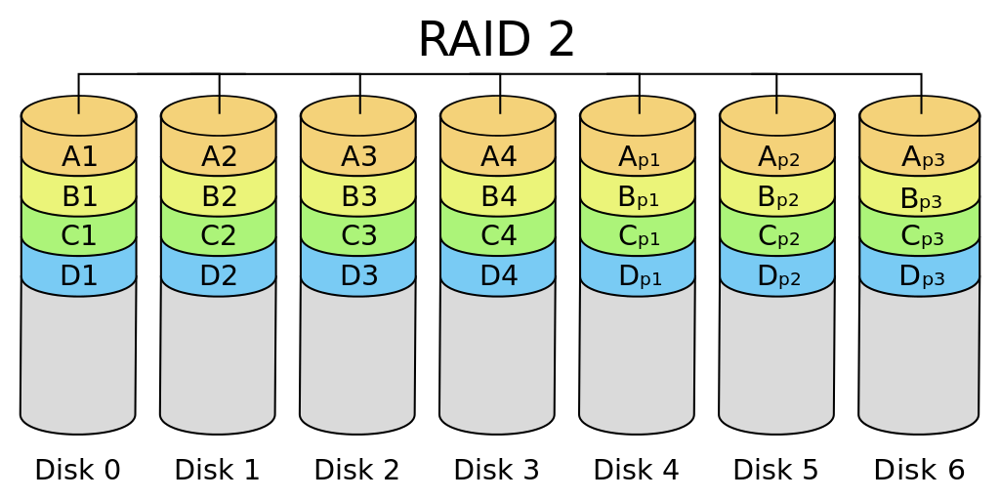

[syscall]: # 'system call (syscall)&#10;Service provided by the kernel that can be called from user mode which typically handles device access requests or other privileged operations.&#10;For most cases, making a syscall breaks down into 3 steps:&#10;  1. Marshall parameters - user mode puts the syscall parameters and number at locations defined by the ABI.&#10;  2. Special instruction - user mode uses a special processor instruction to transition to kernel mode for the syscall.&#10;  3. Handle the return - after the syscall is serviced, the kernel uses a special processor instruction to return to user mode and user mode checks the return value.&#10;"WSL System calls". _Windows Subsystem for Linux_. Microsoft.'
[ProcFs]: # 'ProcFs&#10;Special filesystem in Unix-like operating systems that presents information about processes and other system information in a hierarchical file-like structure, typically mapped to /proc at boot time.&#10;"procfs". _Wikipedia_.'
[SysFs]: # 'SysFs&#10;Pseudo file system provided by the Linux kernel that exports information about various kernel subsystems, hardware devices, and associated device drivers from the device model of the kernel to user space through virtual files.&#10;"sysfs". _Wikipedia_.'
[TmpFs]: # 'TmpFs&#10;Temporary file storage paradigm implemented in many Unix-like operating systems. It is intended to appear as a mounted file system, but data is stored in volatile memory instead of a persistent storage device.&#10;"tmpfs". Wikipedia.'

# Linux
Table of contents
:---:
[Configs](configs.md) &bull; [Commands](commands.md#commands) &bull; [Tasks](commands.md#tasks) &bull; [Sources](sources.md)

Topic                           | Contents
:---                            | :---
Desktop environments            | [GNOME](gnome.md) [KDE](kde.md) [i3](i3.md)
Distributions                   | [Arch Linux](distributions.md#arch-linux) [BSD](distributions.md#bsd) [Clear Linux](distributions.md#clear-linux) [Fedora CoreOS](#distributions.md#fedora-coreos) [Kali Linux](distributions.md#kali-linux) [Mac OS X](macosx.md)
Packaging                       | [Flatpak](#flatpak)
Others                          | [Boot sequence](#boot-sequence) [Namespaces](#namespaces) [PulseAudio](pulseaudio.md) [RAID](#raid) [Runlevels](#runlevels) [X](X.md)

#### Concepts
**P** 
[ProcFs][ProcFs] 
**S** 
[syscall][syscall] 
[SysFs][SysFs] 
**T** 
[TmpFs][TmpFs] 

### Boot
Bootloaders like GRUB (GRand Unified Bootloader) or _u-boot_ turns on power supplies and scans buses and interfaces to locate the kernel image and the root filesystem. LILO (LInux LOader) is also another bootloader that can be found on older Linux systems (LALOS)

Microcontrollers may be listening when the system is nominally off; they typically have their own BIOS and kernels and are inaccessible from the main system
- **Baseboard Management Controller (BMC)** responds to **wake-on-LAN (WOL)**
- **Intel Management Engine (IME)** `x86_64` software suite for remote management of systems; firmware is based on `Minix` and runs on the **Platform Controller Hub** processor, not the main CPU
- **System Management Mode (SMM)** launches UEFI software

**`initrd`** (Initial RAM disk) is a temporary file system that's loaded into memory when the system boots

Linux kernel is typically named **vmlinux** (or **vmlinuz** when compressed). Kernel ring buffer contains messages related to the Linux kernel. A ring buffer is a data structure that is always the same size; old messages are discarded as new ones come in, once the buffer is full. `dmesg` is used to see its contents, and the messages are also stored in `/var/log/dmesg`


### System logging
Traditionally, `syslogd` was the daemon in charge of this, but recently alternatives such as `rsyslog` and `syslog-ng` have emerged. 

\#    | Severity      | Description
:---  | :---          | :---  
0     | Emergencies   | Most severe error conditions that render the system unusable
1     | Alerts        | Conditions requiring immediate attention
2     | Critical      | Condition that should be addressed to prevent an interruption of service
3     | Error         | Error conditions that do not render the system unusable
4     | Warning       | Specific operations failed to complete successfully
5     | Notifications | Non-error notifications that alert an administrator about state changes within a system
6     | Informational | Detailed dinformation about the normal operation of a system
7     | Debugging     | Highly detailed information used for troubleshooting

### Processes
- every process has a parent; a process can **spawn** children
- a process runs in its own **user address space**, a protected space which can't be disturbed by other users
- all processes on a Linux system are child processes of a common parent: the `init` process which is executed by the kernel at boot time (PID 1)
- every Linux process inherits the environment (PATH variable, etc) and other attributes of its parent process

Process creation:
1. `FORK` copy process invoking it as `fork()`
2. `EXEC` parent then overwrites this copy with the program that has to be executed which replaces or **overlays** the text and data areas as `exec()` system call
3. `WAIT` parent waits for `SIGTERM` signal which the child will send upon completion `wait()` system call

1. **`TEXT SEGMENT`**: executable code
2. **`DATA SEGMENT`**: variables and arrays the program uses during execution
3. **`USER SEGMENT`**: process attributes
  - process ID (PID)
  - real user ID of user who created it (stored in /etc/passwd)
  - real group ID
  - priority

- Internal commands (`cd`, `echo`, etc. and variable assignments) do not spawn child processes
- Shell scripts are executed by spawning a sub-shell, which becomes the script's parent
- External commands are spawned as children of the parent as described above

### Low priority jobs
Priorities range from 0-19 in `csh` (10 is default); higher values run at lower priority
```sh
nice
```
View priorities of jobs
```sh
ps -l
```
Run `cmd` at a higher priority
```sh
nice -5 cmd &
```

### Cgroups
**Control group (cgroups)** is a Linux kernel feature that isolates a collection of processes.
- allow you to allocate resources (CPU time, system memory, network bandwidth, or combinations thereof) among user-defined groups of processes
- like processes, cgroups are hierarchical and inherit attributes from parents, but they from separate trees branching off from `subsystems` (also: `resource controller`, or just `controller`), each of which represent a single system resouce 
  - `blkio` sets limits on input/output access from block devices
  - `cpu` which provides access to the CPU
  - many more...
- different from `namespaces`
  - good for limiting the resources available to a container
  - `systemd` uses cgroups
  - first heard about in Linux Unplugged 289, in the context of Fedora supporting v2 whereas most userspace applications support v1

Process IDs in the same **namespace** can have access to one another, whereas those in different namespaces cannot. Spawning a process in a new namespace prevents it from seeing the host's context, so an interactive shell like `zsh` spawned in its own namespace will report its PID as `1`, even though the host will assign its own PID. This is the concept behind [**containers**](../devops/README.md#containers). [[55](sources.md)]

### Graphical environments
Fully-featured **desktop environments** are distinct from **window managers**, which are more focused in scope

### Filesystems
**Index node (inode)** is a data structure that stores all the information about a file except its name and data
Most modern Linux distributions use the `ext4` filesystem, which descends from `ext3` and `ext2`, and ultimately `ext`. Other filesystems in use include `btrfs`, `xfs`, and `zfs`
Source: [^](https://opensource.com/article/18/4/ext4-filesystem "opensource.com: \"Understanding Linux filesystems: ext4 and beyond\"")

#### ext
**Extended File System** was first implemented in 1992 by Remy Card to address limitations in the MINIX filesystem, which was used to develop the first Linux kernel. It could address up to 2GB of storage and handle 255-character filenames and had only one timestap per file.

**ext2** was developed by Remy Card only a year after `ext`'s release as a commercial-grade filesystem, influenced by BSD's Berkeley Fast File System. It was prone to corruption if the system crashed or lost power while data was being written and performance losses due to fragmentation. Nevertheless, it was quickly and widely adopted, and still used as a format for USB drives.

**ext3** was adopted by mainline Linux in 2001 and uses **journaling**, whereby disk writes are stored as transactions in a special allocation, which allows a rebooted system to roll back incomplete transactions. 3 journaling modes: [journal](#ext "lowest risk journaling mode in ext3, writes both data and metadata to journal before commiting it to filesystem"), [ordered](#ext "default journaling mode in ext3, writes metadata to journal but commits data directly to the filesystem"), and [writeback](#ext "least safe journaling mode in ext3, metadata is journaled but data is not")

**ext4** was added to mainline Linux in 2008, developed by Theodore Ts'o, and improves upon `ext3` but is still reliant on old technology.

#### ZFS
- true next-generation filesystem with a problematic license
- **ZFS on Linux (ZOL)** is considered the ugly stepchild of the ZFS community despite the fact that the Linux implementation has the most features and the most community support
- ZFS is too tightly bound to the operation of the kernel to operate in true userspace, and that is why each implementation is different for operating systems 
  - ZFS is too tightly bound to the operation of the kernel to operate in true userspace, and that is why each implementation is different for operating systems 
- ZFS is too tightly bound to the operation of the kernel to operate in true userspace, and that is why each implementation is different for operating systems 
- LU: 284


**B-Tree Filesystem "butter fs"** was adopted by SUSE Enterprise Linux, but support was dropped by Red Hat in 2017.

### Filesystem access control lists
**Filesystem access control lists (FACL)** allow you to grant permissions to more than one group, i.e. in cases where more than one department of a corporation needs access to the same files.  They are made up of _access control entries_ (ACE). FACL permissions will be indicated in a `ls -l` command by the presence of a "+" after the symbolic notation for the traditional UGO permissions. **Acl** is a dependency of `systemd`.

To enable it, add ",acl" to options in `fstab` file, then mount/unmount disk. If enabling FACL on root partition, system has to be rebooted.

### RAID

Description | Image
---         | ---
**RAID 0** Built with no internal redundancy, each disk provides its full capacity to the array as usable storage. Although technically single disk can work, at least two disks is more typical. | 
**RAID 1** Mirrored set of drives, which have to be the same size or space will be forfeited to accomodate the smallest drive. | 
**RAID 2**  | 
**RAID 3**  | 
**RAID 4**  |  
**RAID 5** Middle ground which stripes data across multiple drives but with some redundancy, requiring at least **3** disks. An array containing *n* drives makes *n - 1* drives' worth of storage, with one drive's worth of space being used to provide redundancy. | 
**RAID 6**  | 
**RAID 10** Multiple RAID 1 arrays are treated as drives in a RAID 0, so data is striped across mirrored arrays. | 
**RAID 50** Multiple RAID 5 arrays contained in a RAID 0, and because there are at least of such arrays involved the minimum number of drives is **6**. | 

### Time
Connection to an NTP server is necessary for a variety of services.\
Linux systems have two clocks:
1. hardware clock/real-time clock (RTC)
2. system clock

Manually synchronize hardware clock to system clock (generally only required if **no NTP server is available**)
```bash
hwclock --hctosys
```

### Security
#### Library injections
Similar to DLL files on Windows systems, .so ("shared object") library files on Linux allow code to be shared by various processes. They are vulnerable to injection attacks. One file in particular, **linux-vdso.so.1**, finds and locates other shared libraries and is mapped by the kernel into the address space of every process. This library-loading mechanism can be exploited through the use of the environment variable **`LD_PRELOAD`**, which is considered the most convenient way to load a shared library in a process at startup. If defined, this variable is read by the system and the library is loaded immediately after linux-vdso.so.1 into every process that is run. [^](https://www.networkworld.com/article/3404621/tracking-down-library-injections-on-linux.html "networkworld.com: \"Tracking down library injections on Linux\"")

This attack can be detected using the **[osquery](https://osquery.io/)** tool. This tool represents the system as a relational database which can then be queried, in particular against the **process_envs** table.

## Tasks
Change hostname 
```bash
sudo hostnamectl set-hostname newhostname
```
Check kernel version [^](https://linuxize.com/post/how-to-check-the-kernel-version-in-linux/ "linuxize.com: \"How to check the Kernel version in Linux\"")
```bash
uname -srm
```
```bash
hostnamectl | grep "Kernel"
```
```bash
cat /proc/version
```

