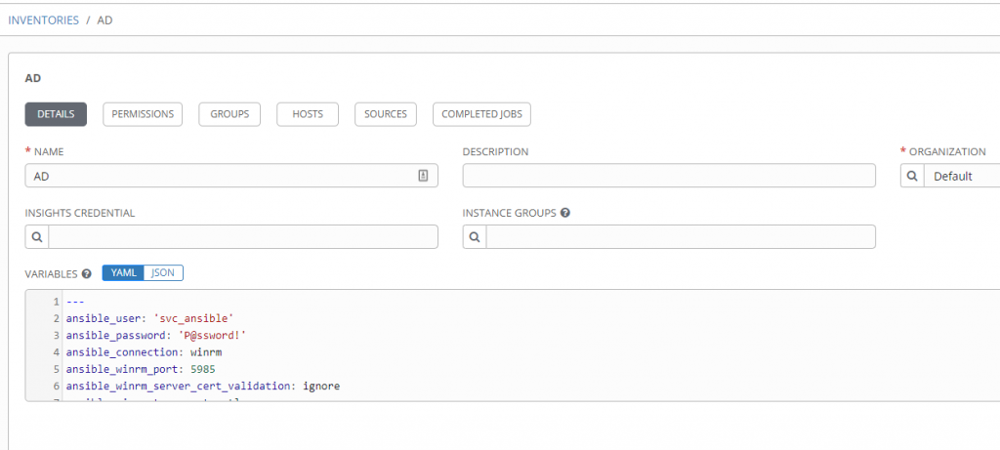
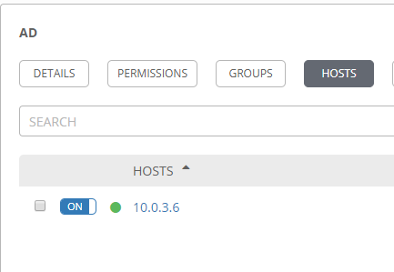
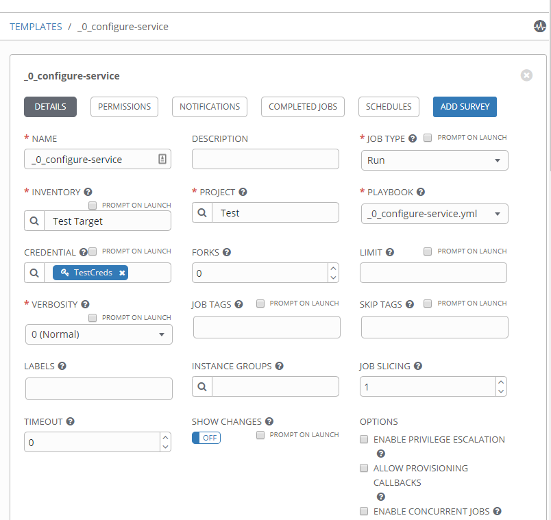

# Ansible, Windows, and PowerShell
In Part 1 of this series we’ll warm up by taking a look at the lab setup I am using, configuring some basics in AWX and what’s possible with the Ansible win_service module to configure Windows services.
#### Lab details
For Ansible, I’m using AWX deployed in containers based from the example documented here.\ 
Additionally, I have two Windows 2016 VMs. One to provide some basic Windows services such as DNS and Active Directory. The second a plain, vanilla install to test the Ansible playbooks on.
#### Source Control
I store the Ansible playbooks in this series in my personal Github repository which make them easy to access and maintain, also they can be retrieved in AWX simply be pointing a project to this repo.
#### AWX Configuration
Within AWX I have first of all configured a Project which points to my GitHub Playbook repository, so that I can easily select Playbooks stored there in Job Templates. Note that no credentials are required for this project since it is public and I only need to read the contents:

I have two separate Inventories configured, one for the Windows AD / DNS server and one for the vanilla Windows server. Note these inventories could be combined depending on requirements, I’m just using two for demo purposes.
#### AD Inventory
I’ve set Ansible Windows winrm connection variables here:\

The IP address of the AD server is specified on the Hosts tab:\

#### Test Target Inventory
The test Windows server has the same connection variables, but a different IP address listed on the Hosts tab:\

I’ve created a Credentials object to use in Job Templates:\

With those pre-requisites in place, we can move onto a job template where I have completed the following fields:
- `Name`: _0_configure-service (for ease of demo I’ve set it to the name of the playbook and the order I demonstrated them during the presentation.)
- `Job Typ`e: Run
- `Inventory`: Test Target (the inventory which includes the vanilla Windows server)
- `Project`: Test (my GitHub Playbooks repo)
- `Playbook`: _0_configure-service.yml (a handy drop-down selector of Playbooks discovered by AWX in the project)
- `Credential`: TestCreds (the credentials used to give permissions within Windows)


The contents of the `_0_configure-service.yml` used in the above job template are below:
```yaml
---
- hosts: all
  tasks:

  - name: Check if a service is installed
    win_service:
      name: SNMPTRAP
    register: service_info

  - name: Configure the BITS Service
    win_service:
      name: SNMPTRAP
      state: started
      start_mode: auto
```