# Ansible, Windows, and PowerShell

Table of contents
:---:
[ 1 ](#1) &bull; [ 2 ](#2) &bull; [ 3 ](#3) &bull; [ 4 ](#4) &bull; [5](#5) &bull; [6](#6) &bull; [7](#7) &bull; [8](#8) &bull; [9](#9) 

## 1
In Part 1 of this series we’ll warm up by taking a look at the lab setup I am using, configuring some basics in AWX and what’s possible with the Ansible `win_service` module to configure Windows services.
#### Lab details
For Ansible, I’m using AWX deployed in containers based from the example documented here.\ 
Additionally, I have two Windows 2016 VMs. One to provide some basic Windows services such as DNS and Active Directory. The second a plain, vanilla install to test the Ansible playbooks on.
#### Source Control
I store the Ansible playbooks in this series in my personal Github repository which make them easy to access and maintain, also they can be retrieved in AWX simply be pointing a project to this repo.
#### AWX Configuration
Within AWX I have first of all configured a Project which points to my GitHub Playbook repository, so that I can easily select Playbooks stored there in Job Templates. Note that no credentials are required for this project since it is public and I only need to read the contents:
\
I have two separate Inventories configured, one for the Windows AD / DNS server and one for the vanilla Windows server. Note these inventories could be combined depending on requirements, I’m just using two for demo purposes.
#### AD Inventory
I’ve set Ansible Windows winrm connection variables here:\
\
The IP address of the AD server is specified on the Hosts tab:\
\
#### Test Target Inventory
The test Windows server has the same connection variables, but a different IP address listed on the Hosts tab:\
\
I’ve created a Credentials object to use in Job Templates:\
\
With those pre-requisites in place, we can move onto a job template where I have completed the following fields:
- `Name`: _0_configure-service (for ease of demo I’ve set it to the name of the playbook and the order I demonstrated them during the presentation.)
- `Job Typ`e: Run
- `Inventory`: Test Target (the inventory which includes the vanilla Windows server)
- `Project`: Test (my GitHub Playbooks repo)
- `Playbook`: _0_configure-service.yml (a handy drop-down selector of Playbooks discovered by AWX in the project)
- `Credential`: TestCreds (the credentials used to give permissions within Windows)

\
The contents of the `_0_configure-service.yml` used in the above job template are below:
```yaml
---
- hosts: all
  tasks:

  - name: Check if a service is installed
    win_service:
      name: SNMPTRAP
    register: service_info

  - name: Configure the BITS Service
    win_service:
      name: SNMPTRAP
      state: started
      start_mode: auto
```
The first task checks for the presence of the SNMPTTRAP Windows service and returns details about it. The second task ensures that the SNMPTTRAP Windows service is started and the Startup Type is set to automatic.\
Starting a job from AWX from the job template above results in the below successful outcome:\
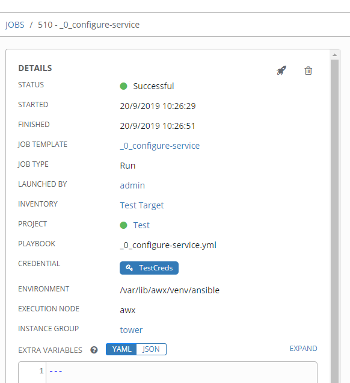\
\
The first task reports that the SNMPTTRAP Windows service exists and if we click on that item we can see the details reported back:\
\
For the second task, I checked before running the job and the SNMPTTRAP Windows service was stopped and set to a Startup Type of Manual.\
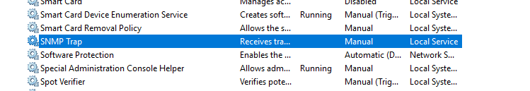\
The Ansible job reported that it had made a change:\
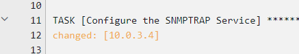\
Checking the change shows the SNMPTTRAP Windows service was started and set to the desired Startup Type of Automatic.\
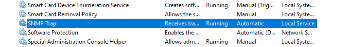\
Now that we have established the lab setup, how to configure a project, inventory, job template in AWX and run a simple job, we’ll move onto further posts in this series on other Windows and PowerShell topics.\

---
## 2

In Part 2 of this series we’ll move on from the introductory topics and look at how we can use Ansible to prepare servers with any external PowerShell Modules they need from the PowerShell Gallery.\
Our job template in AWX is _1_install-psmodule\
\
The contents of _1_install-psmodule.yml are are follows:
```yaml
---
- hosts: all
  tasks:
  - name: Powershell | Install Required Powershell Modules
    win_psmodule: name={{ item }} state=present
    with_items:
      - PowervRA
      - PowervRO
```
We can use the native Ansible module win_psmodule to do the work for us. In addition, we can ensure multiple modules are installed without needing a separate task for each one by looping using with_items. This enables us to simply supply the names of the modules for the PowerShell Gallery that we need and Ansible will install both of them.\
Looking at our vanilla Windows 2016 server, we can observe that prior to running the job template neither the PowervRA or PowervRO modules are installed.\
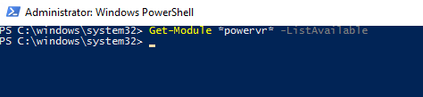\
Running a job from the _1_install-psmodule job template produces a successful result:\
\
\
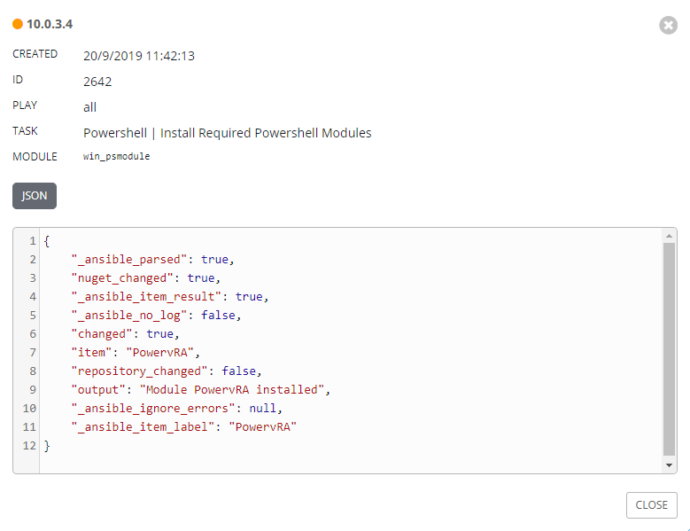\
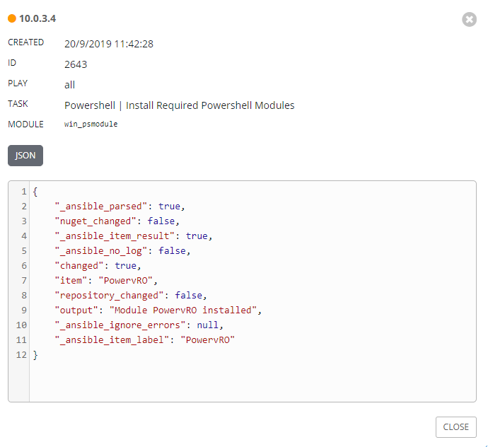\
Checking our vanilla Windows 2016 server, we can now observe that both the PowervRA or PowervRO modules are installed and available for further automation.\
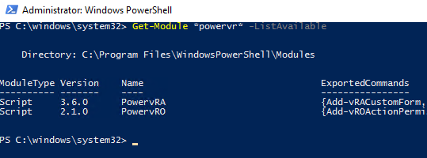

---
## 3
In Part 3 of this series we’ll continue our journey with Ansible, Windows and PowerShell and look at how we can use Ansible to prepare servers with Windows Roles and Features.\
The PowerShell story around support for Windows Roles and Features can be a little confusing, since there are two different sets of PowerShell cmdlets as well as the cmdline tools dism.exe and pkgmgr.exe. So knowing which tool to use to start with requires some effort itself. I’ve briefly mentioned it before in a previous post, but the most useful source of comparison I’ve found between the different options is this site.\
It’s a similar story when we turn to Ansible support for Windows Roles and Features since there are two modules to achieve similar outcomes, win_feature and win_optional_feature. The difference between them appears to arise from which PowerShell cmdlets the modules are using under the hood:\
- The code for the `win_feature` module is using cmdlets from the PowerShell ServerManager module
- The code for the `win_optional_feature` is cmdlets from the PowerShell `Dism` module

In the main both of them should get you to the same end result, so the choice is yours. In this post, we’ll be concentrating on the win_feature Ansible module.\
Our job template in AWX is _2_install-windowsfeature 
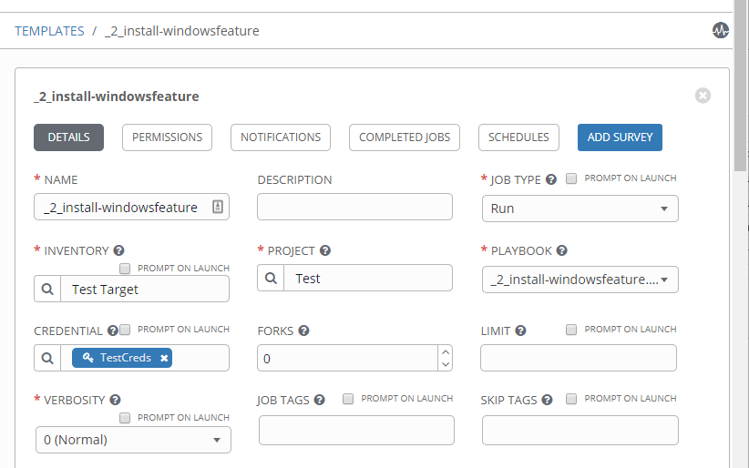\
The contents of _2_install-windowsfeature.yml are are follows:
```yaml
---
- hosts: all
  tasks:

  - name: Install Remote-Desktop-Services
    win_feature:
      name: Remote-Desktop-Services
      state: present
      include_management_tools: yes

  - name: Uninstall Print-Services
    win_feature:
      name: Print-Services
      state: absent
```
The first task installs Remote-Desktop-Services including the management tools and the second task removes `Print-Services`.\
Before running any job, looking at our vanilla Windows 2016 server below, we can observe that Remote-Desktop-Services is not present, but Print-Services is there.\
\
Running a job from the _2_install-windowsfeature job template produces a successful result:\
\
\
Checking our vanilla Windows 2016 server, we can now observe that Remote-Desktop-Services is present and Print-Services has been removed.\
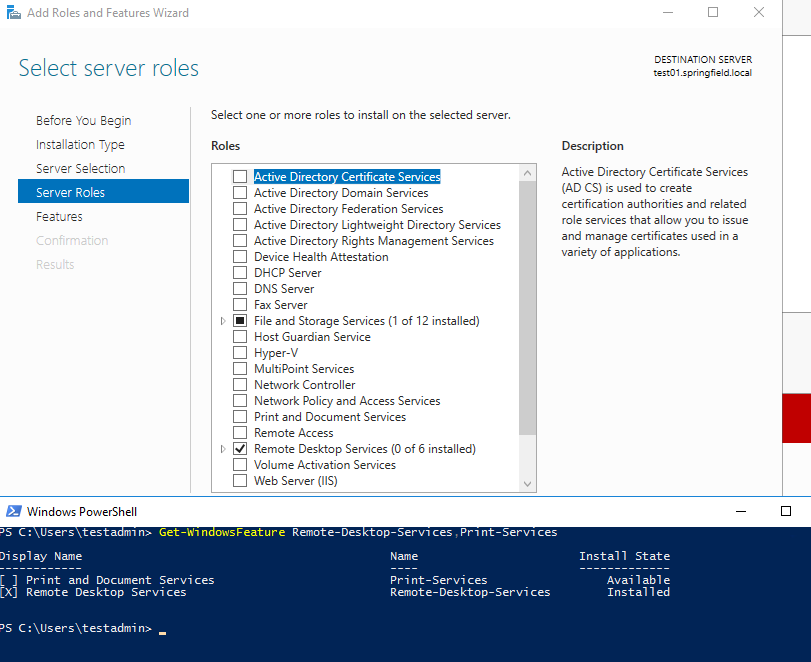\

---
## 4
In Part 4 of this series we’ll continue our journey with Ansible, Windows and PowerShell and look at how we can use Ansible to invoke PowerShell code directly.\
Our job template in AWX to test out the possible different scenarios is _3_invoke-powershell\
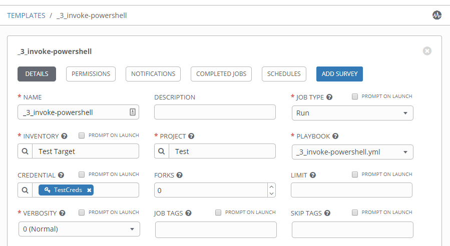\
The contents of _3_invoke-powershell.yml are are follows:\
```yaml
---
- hosts: all
  tasks:

  - name: Single line PowerShell
    win_shell: Set-Content -Path C:\temp\test.txt -Value 'Hello there. '

  - name: Run multi-lined shell commands
    win_shell: |
        $text = Get-Content C:\Temp\test.txt
        $text += ' General Kenobi....you are a bold one'
        Set-Content -Path C:\Temp\test2.txt -Value $text
  - name: Copy a single file
    win_copy:
      src: "{{ playbook_dir }}/files/test.ps1"
      dest: C:\Temp\test.ps1

  - name: Run a script
    win_shell: C:\temp\test.ps1
```
There are three main options we can take for approaching invoking PowerShell code, all using the win_shell module in some form.
#### Run a single line of PowerShell
If the requirement is only to run a simple / single command in PowerShell, then it probably doesn’t make sense to have the code for that contained in a script, copied to the Windows machine, then executed. The win_shell module enables you to do that inline:
```yaml
- name: Single line PowerShell
  win_shell: Set-Content -Path C:\temp\test.txt -Value 'Hello there. '
```
#### Run multi-lined PowerShell commands 
If the requirement is to run multiple lines of PowerShell code then it is still possible to include the code inline, it just needs to be laid out as follows across multiple lines in the playbook:
```yaml
- name: Run multi-lined shell commands
  win_shell: |
    $text = Get-Content C:\Temp\test.txt
    $text += ' General Kenobi....you are a bold one'
    Set-Content -Path C:\Temp\test2.txt -Value $text
```
#### Run a PowerShell script
If the requirement is to run more code than the above, then the best option may be to put all of that code into a PowerShell script, get it onto the Windows machine and have Ansible execute it. There are of course many ways to get the script onto the machine, in this instance I am using the built-in variable playbook_dir as a known location to copy it from on the Ansible server. The script is in a files sub-folder of the playbook repository:
```yaml
- name: Copy a single file
  win_copy:
    src: "{{ playbook_dir }}/files/test.ps1"
    dest: C:\Temp\test.ps1

- name: Run a script
  win_shell: C:\temp\test.ps1
```
The code within the test.ps1 script:
```powershell
Set-Content -Path C:\Temp\test3.txt -Value "That's so wizard Ani"
```
Running a job from the _3_invoke-powershell job template produces a successful result:\
\
\
#### Run a single line of PowerShell
Viewing the log shows us the command that was run:\
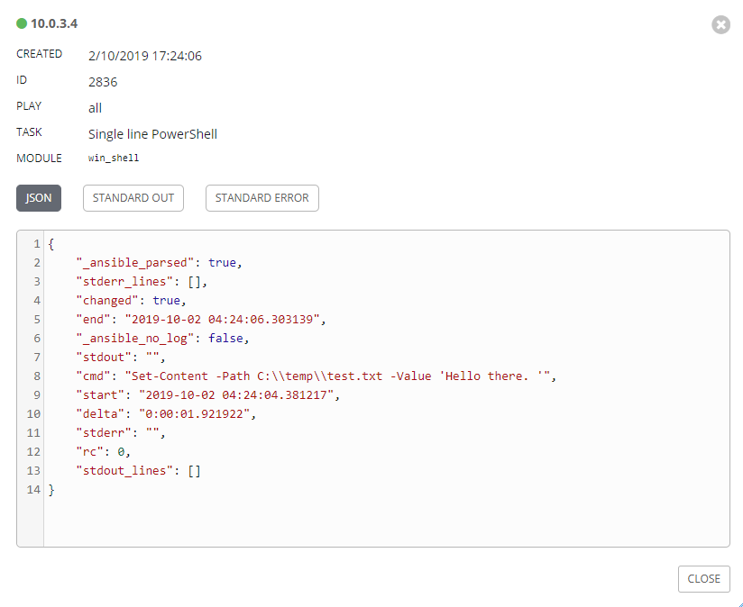\
Checking our vanilla Windows 2016 server we can observe the presence and content of the test.txt file:\
\
#### Run multi-lined PowerShell commands
Viewing the log shows us the command that was run:\
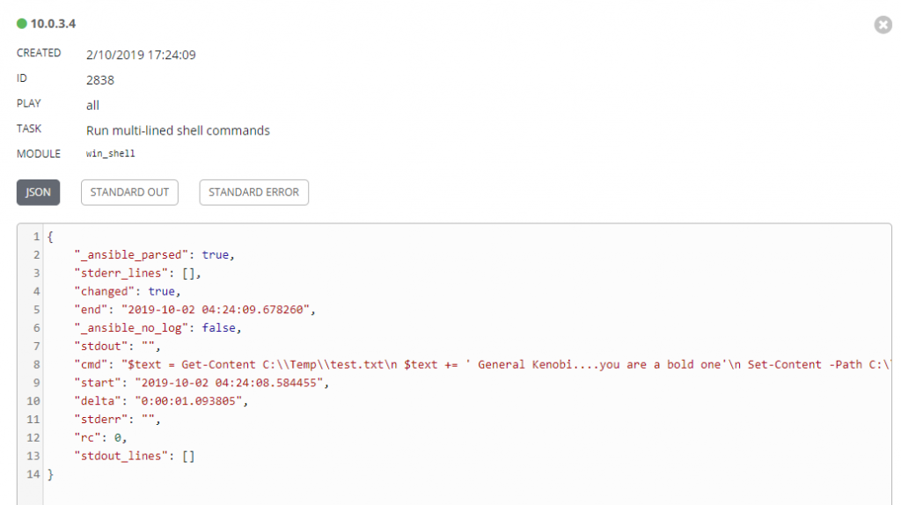\
Checking our vanilla Windows 2016 server we can observe the presence and content of the test2.txt file:\
\
#### Run a PowerShell script
Viewing the log shows us the command that was run:\
\
Checking our vanilla Windows 2016 server we can observe the presence and content of the test3.txt file:\
\
So those are the basics for invoking PowerShell code. You may also be interested in two other related posts I have in this area which I won’t be covering in this basics series:

## 5
In Part 5 of this series we’ll continue our journey with Ansible, Windows and PowerShell and look at how we can lay out code in PowerShell scripts in order to return error codes to Ansible to determine the success or failure of a task.\
In my experience different automation and orchestration toolsets can require you to return errors from PowerShell scripts in different ways. So far with Ansible I have found that returning an exit code of 0 (success) or 1 (failure) from the PowerShell script to Ansible will result in the success or failure of that task in the Playbook. I experimented with other numbers for return codes to see if I could use them to establish different types of failure, but Ansible did not appear to support that. (If you have other experiences with PowerShell, return codes and Ansible then please leave them in the comments below.)\
So the following example will demonstrate how to ensure that an exit code of 0 or 1 is returned from the PowerShell script executed by Ansible to the task which executed it.\
Our job template in AWX is _4_example-errorhandling\
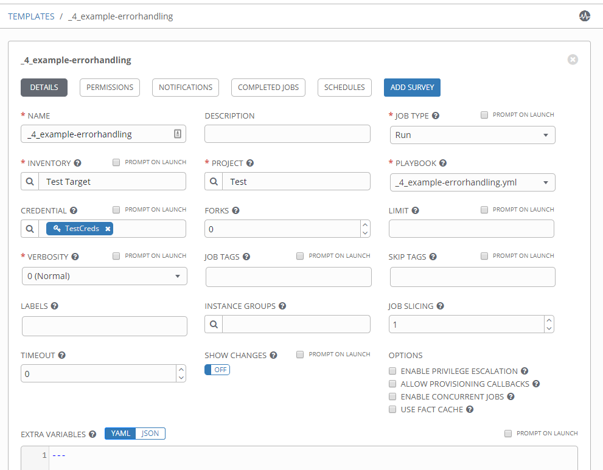\
The contents of _4_example-errorhandling.yml are are follows:
```yaml
---
- hosts: all
  tasks:

  - name: Copy a single file
    win_copy:
      src: "{{ playbook_dir }}/files/Example-ErrorHandling.ps1"
      dest: C:\Temp\Example-ErrorHandling.ps1

  - name: Run a script
    win_shell: C:\Temp\Example-ErrorHandling.ps1
```
The first task copies the PowerShell script with the example error handling to the target and the second task executes that script.\
The contents of Example-ErrorHandling.ps1 are as follows:
```powershell
#Requires -RunAsAdministrator
$ErrorActionPreference ='Stop'

# Get a service which doesn't exist
try {
    Get-Service "This will fail"
}
catch {

    Write-Error "Unable find service" -ErrorAction Continue
    Write-Error $_.Exception.Message -ErrorAction Continue
    exit 1
}

exit 0
```
Two things to note:
#### Setting `$ErrorActionPreference` to Stop
Not all errors generated in PowerShell by cmdlets are the same! There are two types, terminating and non-terminating, and only terminating errors will take you into the catch block. Consequently, you may get errors in your script that are non-terminating, but the script could still be determined a success. Sometimes you may be surprised about what a cmdlet author determined to be a non-terminating error – this has caught me out a number of times in the past.\
So, depending on how you want to handle this scenario, you may wish to set $ErrorActionPreference to Stop. This will force even non-terminating errors to take the code into the catch block and consequently exit the script with a return code of 1.\
#### `-ErrorAction Continue`
On a similar note, watch out for the -ErrorAction Continue added to the end of the Write-Error lines in the catch block. A consequence of setting $ErrorActionPreference to Stop means that Write-Error will generate a terminating error, not the non-terminating error that is its default behaviour. Without forcing the ErrorAction to be Continue for those to lines only, the script would exit at line 10 and the extra error lines won’t be present in the output.\
Running a job from the _2 example-errorhandling job template produces the failed result we are looking for:\
\
\
Looking at more detail to the task with the error, we can observe that we received an exit code of 1 and the detailed error info from the catch block:\
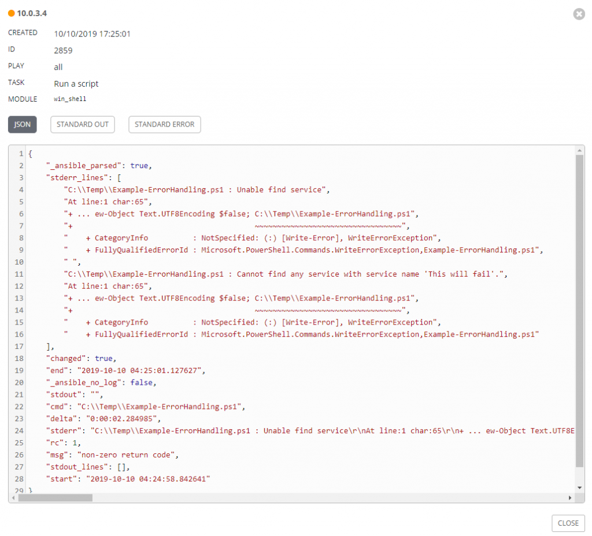

---
## 6
In Part 6 of this series we’ll continue our journey with Ansible, Windows and PowerShell and look at how we can display output from code in PowerShell scripts back in Ansible to help track the progress of a task.\
The following example will demonstrate how to send log info from a PowerShell script back to Ansible.\
Our job template in AWX is _5_log-output\
\
The contents of _5_log-output.yml are are follows:\
```yaml
---
- hosts: all
  tasks:

  - name: Copy a single file
    win_copy:
      src: "{{ playbook_dir }}/files/test-output.ps1"
      dest: C:\Temp\test-output.ps1

  - name: Run a script
    win_shell: C:\Temp\test-output.ps1
    register: result

  - debug: var=result.stdout_lines
```
The first task copies the PowerShell script demonstrating how to output log text to the target and the second task executes that script, and most importantly registers the result in the variable named result. The third task debugs the stdout_lines property of the result which contains what we’ll be looking for. This Ansible documentation page details what is available to you when returning data and registering into a variable.\
The contents of test-output.ps1 are as follows:
```powershell
Write-Host "And you, young Skywalker. We will watch your career with great interest."

Write-Host "Always two, there are. No more, no less. A master and an apprentice"

Write-Host "VM: 10.0.3.4"
Write-Host "VM: 10.0.3.6"
```
Running a job from the _5_log-output job template produces the following result:\
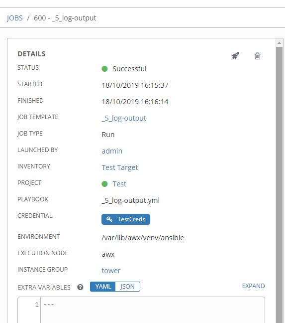\
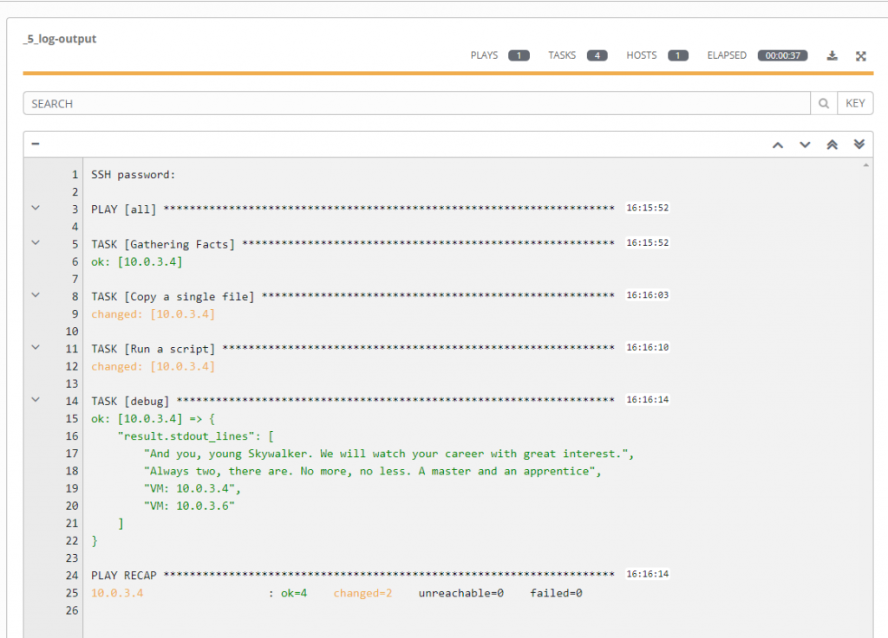\
The script was successfully copied and executed. The information from the Write-Host commands was not displayed by default in the Run a script task, however by adding a debug task we are able to grab the log info from the stdout_lines property.\
For a more advanced look at returning data from PowerShell scripts, take a look at this post I made outside of this series.

---

## 7
In Part 7 of this series we’ll continue our journey with Ansible, Windows and PowerShell and look at how utilise PowerShell DSC. If you or your team already own some automation created using PowerShell DSC then it is possible to re-use that via an Ansible Playbook. Or maybe you think that you or they would prefer to create configuration automation going forward using a perhaps more familiar PowerShell DSC, then this could be a solution for you.\
The following example will demonstrate how to use the Active Directory DSC module to create a user in AD.\
Our job template in AWX is _6_invoke-dsc\
\
The contents of _6_invoke-dsc.yml are are follows:\
```yaml
---
- hosts: all
  tasks:

  - name: Powershell | Install Required Powershell Modules
    win_psmodule:
      name: xActiveDirectory
      state: present

  - name: Create Test Account
    win_dsc:
      resource_name:  xADUser
      DomainName: springfield.local
      UserName: "test_user"
      Password_password: "P@ssword!"
      Password_username: "dummy"
      Ensure: present
      Path: "OU=Users,OU=HQ,DC=springfield,DC=local"
      DisplayName:  "Test User"
      GivenName:  "Test"
      Surname: "User"
      UserPrincipalName: "test_user@springfield.local"
      Enabled:  true
      PasswordNeverExpires: true
```
Since PowerShell DSC modules are typically located in the PowerShell Gallery, we can use the win_psmodule to make sure it is present on our system. (Part 2 of this series covered installing PowerShell Modules from the PowerShell Gallery with Ansible.) The first task ensures that the Active Directory DSC module , xActiveDirectory, is present.\
The second task uses the win_dsc Ansible module to configure an Active Directory DSC module resource and create a user in AD. We simply need to list some of the properties of the user in order to create it.\
Our Active Directory OU before running the Ansible job contains no user named test_user:\
\
Running a job from the _6_ invoke-dsc job template produces the following result:\
\
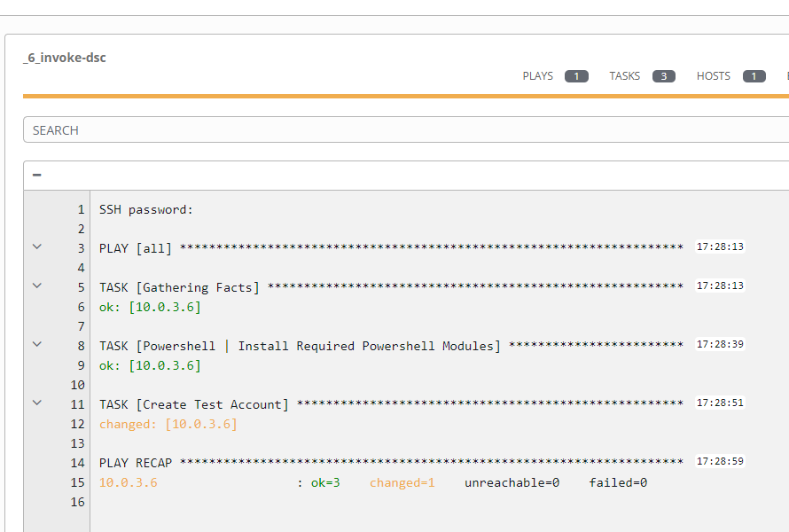\
Now the user test_user is present:
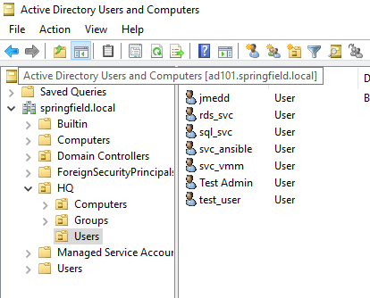\
\
You can use any existing PowerShell DSC module in the PowerShell Gallery to carry out what you need to achieve and drive the automation from Ansible.

---

## 8
In Part 8 of this series we’ll continue our journey with Ansible, Windows and PowerShell and look at how to handle reboots. Despite improvements in Windows over the years, it’s still pretty common as part of VM or application deployment to need to restart the VM and wait for it to be available before carrying on with some further steps.\
The following example will demonstrate how to use the win_reboot and win_wait_for modules to reboot a VM and wait for the RDP port 3389 to be available before carrying on.\
Our job template in AWX is _7_reboot_and_wait\
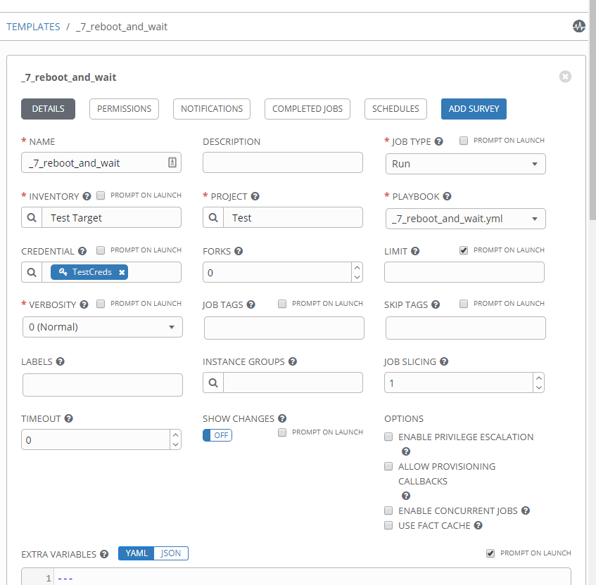\
The contents of _7_reboot_and_wait.yml are are follows:\
```yaml
---
- hosts: all
  tasks:

  - name: Reboot VM
    win_reboot:

  - name: Wait default 300 seconds for port 3389 to become open, don't start checking for 15 seconds
    win_wait_for:
      port: 3389
      delay: 15
```
The first task reboots the VM using the default options, which includes running a test command of whoami in the VM to confirm it has started.\
This can be expanded further in the second task by waiting for a particular to become available. In this example we use the RDP port 3389 to confirm that the VM is ready for us to continue with any further automation.\
Running a job from the _7_reboot_and_wait job template produces the following result:\
\
\
The VM was successfully rebooted and we waited for port 3389 to be responsive before continuing further.

---

## 9
In Part 9 of this series we’ll continue our journey with Ansible, Windows and PowerShell and look at how to handle disk creation. After ‘physically’ adding the new disk, either in a physical server or private / public cloud VM, typically you will need to initialize, partition and format it ready for use.\
In Windows Disk Management a newly added disk will look like Disk 2 below:\
\
The following example will demonstrate how to use a combination of a PowerShell command and the win_disk_facts, win_partition and win_format modules to initialize, partition and format the above newly added Disk 2.\
Our job template in AWX is _8_initialize-partition-format-disk\
\
Note: I have made use of the ‘Prompt on launch’ checkbox for extra variables.\
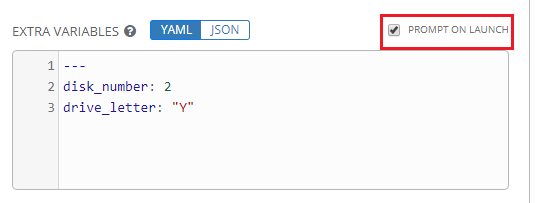\
This means when executing the playbook via the web UI we’ll be prompted to amend the extra variables if we want to, i.e. for a different disk number or drive letter.\
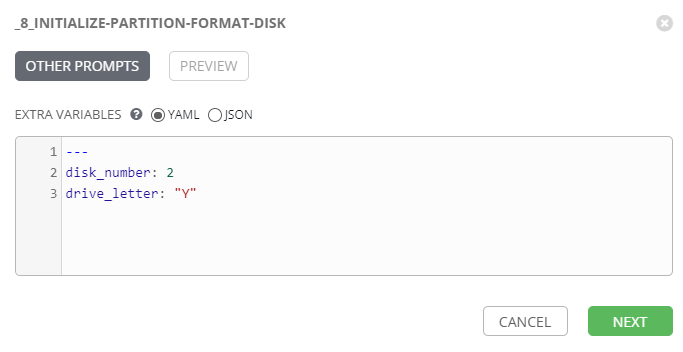\
The contents of _8_initialize-partition-format-disk are are follows:\
```yaml
---
- hosts: all
  tasks:

  - name: Get disk facts
    win_disk_facts:

  - name: Initialize Disk
    win_shell: "Initialize-Disk -Number {{ disk_number }}"
    when: ansible_disks[disk_number].guid is none

  - name: Create Partition using all available space
    win_partition:
      drive_letter: "{{ drive_letter }}"
      partition_size: -1
      disk_number: "{{ disk_number }}"
    when: ansible_disks[disk_number].guid is none

  - name: Format the partition as NTFS and label it
    win_format:
      drive_letter: "{{ drive_letter }}"
      file_system: NTFS
      new_label: Data
    when: ansible_disks[disk_number].guid is none
```
We start out by retrieving disk facts via win_disk_facts . These extra facts are then available to us via the fact ansible_disks. We use a when clause on the subsequent steps to only execute them when the guid property is null, i.e. the disk has not been touched yet.\
There is no Ansible module yet which supports initializing the disk, so we send a PowerShell command using the Initialize-Disk cmdlet to configure that part. Subsequent steps use the win_partition and win_format modules to create a partition with the specified drive letter and then format it with NTFS and a drive label of Data.\
Running a job from the _8_initialize-partition-format-disk job template produces the following result:\
\
\
Checking our disk back in Computer Management we observe that it has been brought online, partitioned and formatted.\
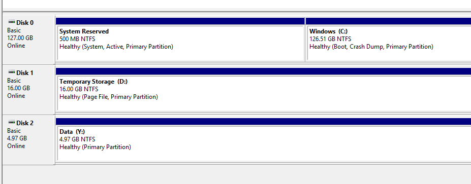

---

## Sources
- "Ansible, Windows, and PowerShell: the Basics - Introduction". [Web](https://www.jonathanmedd.net/2019/09/ansible-windows-and-powershell-the-basics-introduction.html)
- "Ansible, Windows, and PowerShell: the Basics - Part 1, Windows Services". [Web](https://www.jonathanmedd.net/2019/09/ansible-windows-and-powershell-the-basics-part-1-windows-services.html)
- "Ansible, Windows, and PowerShell: the Basics - Part 2, Install PowerShell Modules". [Web](https://www.jonathanmedd.net/2019/10/ansible-windows-and-powershell-the-basics-part-2-install-powershell-modules.html)
- "Ansible, Windows, and PowerShell: the Basics - Part 3, Windows Roles and Features". [Web](https://www.jonathanmedd.net/2019/10/ansible-windows-and-powershell-the-basics-part-3-windows-roles-and-features.html)
- "Ansible, Windows, and PowerShell: the Basics - Part 4, Invoking PowerShell Code". [Web](https://www.jonathanmedd.net/2019/10/ansible-windows-and-powershell-the-basics-part-4-invoking-powershell-code.html)
- "Ansible, Windows, and PowerShell: the Basics - Part 5, Example PowerShell Error Handling". [Web](https://www.jonathanmedd.net/2019/10/ansible-windows-and-powershell-the-basics-part-5-example-powershell-error-handling.html)
- "Ansible, Windows, and PowerShell: the Basics - Part 6, Displaying Output from PowerShell Code". [Web](https://www.jonathanmedd.net/2019/10/ansible-windows-and-powershell-the-basics-part-6-displaying-output-from-powershell-code.html)
- "Ansible, Windows, and PowerShell: the Basics - Part 7, Utilizing PowerShell DSC". [Web](https://www.jonathanmedd.net/2019/11/ansible-windows-and-powershell-the-basics-part-7-utilising-powershell-dsc.html)
- "Ansible, Windows, and PowerShell: the Basics - Part 8, Rebooting and Waiting". [Web](https://www.jonathanmedd.net/2019/11/ansible-windows-and-powershell-the-basics-part-8-rebooting-waiting.html)
- "Ansible, Windows, and PowerShell: the Basics - Part 9, Disk Creation". [Web](https://www.jonathanmedd.net/2019/12/ansible-windows-and-powershell-the-basics-part-9-disk-creation.html)